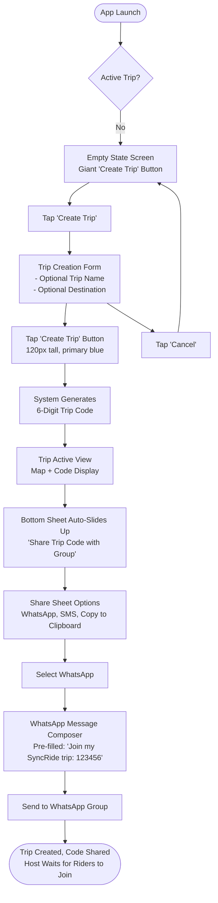
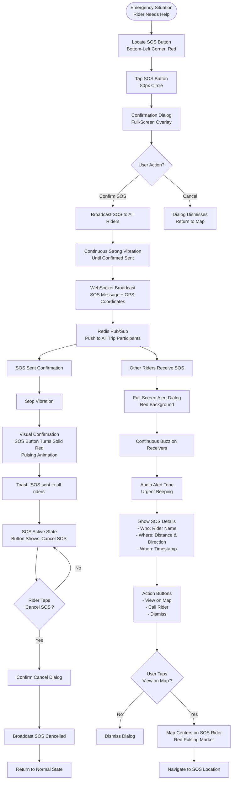

c---
stepsCompleted: ['step-01-init', 'step-02-discovery', 'step-03-core-experience', 'step-04-emotional-response', 'step-05-inspiration', 'step-06-design-system', 'step-07-defining-experience', 'step-08-visual-foundation', 'step-09-design-directions', 'step-10-user-journeys', 'step-11-component-strategy', 'step-12-ux-patterns', 'step-13-responsive-accessibility', 'step-14-complete']
lastStep: 14
workflowStatus: 'complete'
completedDate: '2026-04-10'
inputDocuments:
  - '_bmad-output/prd.md'
  - '_bmad-output/prd-validation-report.md'
  - '_bmad-output/product-brief-syncride.md'
  - '_bmad-output/brainstorming/brainstorming-session-2026-04-10-160749.md'
  - 'project_context.md'
workflowType: 'ux-design'
project_name: 'SyncRide (RouteBuddies)'
---

# UX Design Specification: SyncRide (RouteBuddies)

**Author:** jay
**Date:** 2026-04-10
**Version:** 1.0

---

## Executive Summary

### Project Vision

SyncRide is a real-time geospatial group coordination platform purpose-built for motorcycle touring groups and cycling clubs. It solves the "scattered rider problem"—when traffic, different routes, and dead zones split the pack and create dangerous uncertainty. Unlike chat apps with maps tacked on or fitness trackers focused on solo rides, SyncRide puts live location at the center, creating ephemeral Trip Sessions where every rider's position appears on one synchronized map.

**Core Philosophy:** Ephemeral privacy-forward coordination that disappears when you do. No permanent accounts, no location history graph, no tracking after the ride ends. Map-first design where spatial awareness is instant—no scrolling through messages to understand who's where.

**Platform:** Mobile-first Progressive Web App (PWA) with potential native shell fallback if iOS/Android constraints block core functionality (background GPS, lock-screen SOS). Week 1 platform capability testing determines path forward.

### Target Users

**Primary: Motorcycle Touring Groups (Weekend Warriors to Enthusiasts)**
- Groups of 5-20 riders on day trips, weekend runs, or multi-day tours
- Routes: Mumbai-Goa corridor (India), Thailand's Mae Hong Son Loop, Pacific Coast Highway (California)
- Pain points: Traffic splits pack, different routes create uncertainty, communication fails at speed, dead zones erase visibility
- Success criteria: Complete 300km ride without stopping every 50km to regroup; know instantly when someone falls behind; peace of mind that if something goes wrong, group knows exact location

**Secondary: Cycling Clubs on Group Rides**
- Road cycling clubs doing weekend centuries or gran fondos
- Same pack spreading problem but different speed dynamics
- Need ride leader monitoring and SAG wagon coordination

**Tertiary (Future): Commercial Motorcycle Tour Operators**
- Companies running guided multi-day tours with 10-30 clients
- Need professional coordination layer, duty-of-care documentation, and liability reduction through documented incident response

**User Context:**
- **Tech-savvy:** Moderate—comfortable with smartphones, navigation apps, WhatsApp
- **Primary device:** Smartphone mounted on handlebars (Android Chrome, iOS Safari)
- **Usage environment:** Hostile—sunlight glare, vibration, wind noise, divided attention, wearing motorcycle gloves
- **Usage frequency:** Weekend rides (3-4x per month for enthusiasts), occasional trips (1-2x per month for casual riders)
- **Physical constraints:** Cannot type or perform precise touch while moving; glove thickness (6-12mm) prevents fine motor control

### Key Design Challenges

**1. Glove-Friendly Interaction at 100 km/h**
- Riders wear 12mm neoprene motorcycle gloves making precise touch impossible
- Core flows must work with 6mm minimum touch targets (PRD FR67)
- Interaction must be <1 second glance—eyes stay on road
- Solution space: Voice-first input (tap-to-speak), giant touch targets, haptic feedback patterns, audio narration

**2. Safety-First Design (Zero Distraction)**
- Screen interaction while riding is life-threatening distraction
- Must provide group awareness WITHOUT requiring visual attention
- Balance coordination utility vs accident risk
- Solution space: Lock-screen SOS, haptic proximity alerts, audio-only mode, adaptive UI density based on motion detection

**3. Dead Zone Resilience (Not Edge Case, Core Constraint)**
- Tunnels, mountain passes, rural stretches guarantee connectivity loss
- Users need to distinguish "lost signal in tunnel" from "took wrong turn"
- 2.5km tunnel = 2+ minutes with no updates at highway speed
- Solution space: Client-side buffering with trail replay, last-known position with expanding uncertainty radius, visual decay indicators

**4. Context-Aware Adaptive Interface**
- Usage environment changes dramatically: stationary (rest stop) vs moving (highway) vs moving (city traffic)
- Environmental factors: bright sunlight, night riding, rain/weather visibility
- Different contexts need radically different UI density and interaction patterns
- Solution space: Motion-detected mode switching, ambient light adaptation, speed-based viewport zoom, audio vs visual vs haptic information channels

**5. Platform Constraints (iOS/Android Background GPS)**
- Progressive Web App may not support background location tracking on iOS
- Lock-screen SOS access uncertain in PWA context
- Week 1 testing determines if native shell fallback required
- Solution space: Graceful degradation, clear permission UX, fallback to lightweight native wrapper (Capacitor.js) if needed

### Design Opportunities

**1. Map-First Interface as Competitive Moat**
- Competitors treat location as add-on to messaging (WhatsApp) or fitness tracking (Strava)
- SyncRide inverts this: location IS the interface
- Spatial awareness at a glance—no scrolling, no chat buried messages
- Innovation: Group View auto-zoom to fit all riders, visual group spread indicator, color-coded distance rings, member list with online/offline status

**2. Ephemeral Privacy as Trust Builder**
- Privacy-conscious riders distrust apps with permanent location graphs and social features
- Session-based coordination that "disappears when you do" builds trust
- No permanent accounts (just trip codes), auto-delete on trip end, opt-in 7-day replay with explicit consent
- Innovation: Clear data deletion confirmation UI, ephemeral identity (optional display name only), zero persistent tracking narrative

**3. Context-Aware Adaptive UI**
- UI that adapts to riding state (stationary vs moving) and environmental conditions (sunlight, speed)
- Not one-size-fits-all—UI density, touch targets, information hierarchy change based on context
- Innovation: Motion-detected glance mode, high-contrast sunlight adaptation, audio-only mode for long highway stretches, haptic vocabulary for eyes-free awareness

**4. Voice-First as Primary Interface (Not Accessibility Add-On)**
- Most apps treat voice as accessibility feature; SyncRide treats it as primary input method
- Tap-to-speak for status updates ("Need gas", "Taking break") eliminates typing requirement
- Speech-to-text with intent recognition, audio confirmation feedback
- Innovation: Voice command grammar optimized for helmet/wind noise, keyword detection for short phrases, Bluetooth helmet integration

**5. Production-Grade Real-Time Architecture as UX Feature**
- Sub-500ms P95 latency feels instant (vs competitors with 2-3 second lag)
- Adaptive GPS polling saves 60-80% battery vs fixed-rate polling (all-day rides possible)
- Dead zone buffering with trail replay means no information loss through tunnels
- Innovation: Battery efficiency becomes UX feature ("ride all day without recharging"), latency creates "real-time feel", resilience creates reliability trust

---

## Core User Experience

### Defining Experience

**Core User Action:** Glance at map and instantly see where everyone is.

This atomic unit of value defines SyncRide. The core loop isn't sending messages (WhatsApp), recording routes (Komoot), or tracking fitness stats (Strava)—it's real-time group position awareness at a glance. From Rajesh checking the map at rest stops to see two riders 15km behind, to Priya's relief seeing the pack 4km ahead after tunnel exit, to David monitoring the back of the pack while leading—the experience centers on passive spatial awareness through map visualization.

Everything else (voice status updates, SOS broadcast, trip history) supports this core loop. Users derive value not from interacting with SyncRide, but from *not having to interact*—the map provides continuous group awareness without requiring active attention.

**What users do most frequently:** Open app, glance at map, confirm everyone visible, close app. Average session duration: <10 seconds. Frequency: every 10-15 minutes during active ride.

**Absolutely critical to get right:** Sub-2 second map load with all rider positions visible. If map doesn't render instantly with current positions, core value proposition fails.

### Platform Strategy

**Primary Platform:** Mobile-first Progressive Web App (PWA)

**Rationale:**
- **Zero-install friction:** Share trip code via WhatsApp → tap link → instant join (no App Store download, no signup)
- **Single codebase:** Android + iOS + desktop observers with one implementation
- **Ephemeral alignment:** Session-based coordination doesn't require persistent app installation
- **Web platform maturity:** WebSockets, IndexedDB, Service Workers, Geolocation API production-ready

**Platform Decision Tree:**
- **Week 1 (Phase 1):** Platform capability testing on iOS 15+ and Android 10+
  - Test: Background GPS while app backgrounded
  - Test: Lock-screen SOS button accessibility  
  - Test: Push notification reliability
- **If PWA supports:** Background location, lock-screen access, push notifications → Continue PWA-only
- **If PWA blocked:** iOS restrictions or lock-screen denied → Pivot to lightweight native shell (Capacitor.js wrapper) in Phase 2 (adds 2-3 weeks)

**Input Modality Strategy:**

- **Touch:** Primary for stationary interactions (trip creation, joining, settings, member list browsing)
- **Voice:** Primary when moving (status updates, quick commands via tap-to-speak)
- **Haptic:** Passive awareness channel (proximity alerts, SOS received, connection status)
- **Audio:** Eyes-free awareness via Bluetooth helmet speakers (periodic group status narration)

**Device Context:**
- **Primary:** Smartphone mounted on motorcycle/bicycle handlebars
  - Android: Chrome 90+, Samsung Internet 14+, Edge 90+
  - iOS: Safari 15+ (WebKit engine mandated, applies to Chrome/Edge on iOS)
- **Secondary:** Desktop browsers for observer mode (families, SAG vehicles watching trip remotely)
  - Chrome/Edge (Chromium) latest 2 versions
  - Safari latest 2 versions  
  - Firefox latest 2 versions

**Offline Functionality:** Critical requirement, not nice-to-have

Dead zones (tunnels, mountain passes, rural stretches) are guaranteed on touring routes—not edge cases but core design constraints. Offline-first architecture treats network connectivity as optimization, not requirement.

- **Client-side buffering:** IndexedDB stores location breadcrumbs during network loss
- **Automatic reconnection:** Exponential backoff (1s → 2s → 4s → 8s) with jitter prevents thundering herd
- **Trail replay:** Buffered path replays at 10x speed when connection restores—group sees complete historical reconstruction
- **Data continuity:** No information loss through dead zones, only delayed visibility

### Effortless Interactions

**1. Joining a Trip (Zero-Friction Onboarding)**

**User flow:** Enter 6-digit code → optional display name → you're in

**Effortless means:**
- No signup, no account creation, no email verification
- No profile configuration, no permissions requests upfront
- No onboarding screens or tutorial walkthroughs
- **Result:** Instant participation in <15 seconds from receiving trip code

**Competitor comparison:**
- WhatsApp location sharing: Requires WhatsApp account, buried in message menu, manual start/stop
- Strava live: Requires account, profile setup, follower relationships, premium subscription
- SyncRide: Trip code is only identity—enter and ride

**2. Seeing Group Status (Instant Spatial Awareness)**

**User flow:** Open app → map auto-zooms to show all riders → done

**Effortless means:**
- Zero navigation, zero tapping, zero search
- Group View automatically fits all riders in viewport (PRD FR20)
- No manual zoom, no pan, no "find my group" action required
- **Result:** Instant spatial awareness in <2 seconds from app open

**Competitor comparison:**
- Google Maps shared trip: Must manually zoom, remember who's in group, no auto-framing
- Find My Friends: List-first interface, must tap individual to see on map
- SyncRide: Map-first with automatic group framing

**3. Emergency Broadcast (One-Tap SOS from Lock Screen)**

**User flow:** Single tap giant SOS button → automatic broadcast + coordinate share + nearest rider call initiation

**Effortless means:**
- Accessible in any phone state: app backgrounded, phone locked, screen off
- Works with gloves: giant touch target (entire bottom-third of screen in lock-screen widget)
- Zero navigation: no unlock, no app launch, no menu traversal
- **Result:** <2 seconds from emergency to group notification

**Competitor comparison:**
- WhatsApp: Unlock phone → find app → open chat → type message → send (30-60 seconds, requires fine motor control)
- Phone call: Unlock → find contact → call → explain location verbally (45-90 seconds, unsafe at speed)
- SyncRide: Single tap, instant broadcast, exact coordinates automatically shared

**4. Voice Status Updates (Zero Typing Required)**

**User flow:** Tap bottom-third of screen → speak "Need gas" → auto-broadcast to group

**Effortless means:**
- No keyboard summoning, no text composition, no send button
- Tap zone so large it's impossible to miss with glove (entire bottom-third = 200+ mm tall)
- Speech-to-text automatic with intent recognition (English + Hindi for India launch)
- Audio confirmation feedback (hear "Status sent: Need gas" without looking at screen)
- **Result:** Status broadcast in <3 seconds with zero typing

**Competitor comparison:**
- WhatsApp: Requires keyboard, precise typing (impossible with gloves), unsafe at speed
- Walkie-talkie apps: Require holding button, manual channel management, limited range
- SyncRide: Tap-to-speak with automatic transcription and broadcast

**5. Dead Zone Reconnection (Automatic, Zero User Intervention)**

**User flow:** Enter tunnel → connection drops → exit tunnel → automatic reconnection + trail replay

**Effortless means:**
- No manual refresh, no "retry" button, no error state requiring action
- Exponential backoff with jitter handles reconnection timing automatically
- Buffered location trail replays with animation showing complete path through dead zone
- **Result:** Seamless reconnection with data continuity, zero user action

**Competitor comparison:**
- WhatsApp location: Connection loss shows error, requires manual refresh, loses data during blackout
- Strava live: Hard failure on disconnect, must manually restart tracking
- SyncRide: Automatic reconnection with complete historical reconstruction

### Critical Success Moments

**1. "Relief" Moment (First 5 Minutes of Trip)**

**Context:** Traffic light splits pack, user checks map for first time in motion

**Success criteria:**
- Map loads in <2 seconds on 4G LTE connection
- All rider positions visible with <500ms P95 latency (PRD NFR-P1)
- Clear online/offline indicators (green = live, yellow = stale, red = disconnected)
- Nearest rider distance displayed prominently with color-coding (PRD FR21)

**What users think:** "I can see where everyone is—no panic call needed"

**What failure looks like:**
- Map takes >5 seconds to load → anxiety about missing riders
- Positions stale (>30 seconds old) without indicator → unclear if riders moved or data frozen
- No visual distinction between online/offline → can't tell if rider disconnected or just stationary

**Make-or-break metrics:**
- First Contentful Paint <1.5s (PRD NFR-P6)
- Largest Contentful Paint <2.5s (PRD NFR-P7)  
- WebSocket message delivery >99.5% (PRD NFR-P5)

**2. "Confidence" Moment (Mid-Ride Decision Making)**

**Context:** Rest stop, check map, see two riders 15km behind, decide whether to wait

**Success criteria:**
- Exact positions with distance calculations (PRD FR21, FR22)
- ETA display for separated riders (PRD FR27)
- Last-seen timestamps visible (PRD FR17)
- Group spread indicator showing maximum distance between any two riders

**What users think:** "I have the information I need to make a good decision"

**What failure looks like:**
- No distance metrics → must guess if riders are "close enough" to wait
- No ETA estimates → unclear when separated riders will catch up
- Stale data without staleness indicator → decisions based on outdated positions

**Make-or-break metrics:**
- Redis geospatial queries <100ms (PRD NFR-P3)
- Nearest rider calculation accuracy within 10m (PRD GPS accuracy standards)
- Visual decay indicator activates when data >30 seconds old (PRD FR19)

**3. "Safety" Moment (Emergency Response)**

**Context:** Flat tire on shoulder, tap SOS, need group to turn back

**Success criteria:**
- SOS accessible from lock screen (PRD FR29)
- One-tap broadcast to all riders instantly
- Exact coordinates shared automatically (PRD FR34)
- Haptic SOS alerts on all group devices (distinct continuous buzz pattern - PRD FR33)
- Automatic call initiation to nearest rider

**What users think:** "Help is on the way—they know exactly where I am"

**What failure looks like:**
- SOS requires unlocking phone + navigating UI → too many steps during injury/stress
- Notification delay >5 seconds → nearest riders already passed turn-off
- Imprecise coordinates → rescuers can't find exact location on highway shoulder

**Make-or-break metrics:**
- SOS broadcast latency <1 second (P99)
- Push notification delivery even when app backgrounded (PRD FR35)
- Lock-screen SOS success rate >90% with gloves (must validate Week 1)

**4. "Trust" Moment (Post-Ride Data Lifecycle)**

**Context:** Trip ends, receive notification about data deletion

**Success criteria:**
- Clear data deletion confirmation (PRD FR43, FR59)
- Explicit opt-in modal for 7-day trip replay (PRD FR40, FR55)
- Terms of Service with SOS limitations and distraction disclaimers (PRD FR41)
- No ambiguity about what happens to location data

**What users think:** "My privacy is respected—I'm in control of my data"

**What failure looks like:**
- No deletion confirmation → uncertainty about whether tracking continues
- Unclear data retention → anxiety about permanent location history
- Forced data storage → privacy concerns deter adoption

**Make-or-break metrics:**
- Live data deletion within 30 seconds of trip end (PRD NFR-S10)
- Trip replay hard-deleted after 7 days via database TTL (PRD NFR-S11)
- Data deletion confirmation delivered via push notification

**5. "Glove Test" Moment (First-Time User Onboarding)**

**Context:** New user attempting core flows while wearing motorcycle gloves

**Success criteria:**
- Create trip: success rate >90% with 12mm neoprene gloves
- Join trip: enter 6-digit code successfully with glove
- Send voice status: tap giant button, speak, confirm broadcast
- Trigger SOS: one-tap from lock screen with glove

**What users think:** "This app was actually built for riders—it works with my gear"

**What failure looks like:**
- Small buttons impossible to tap with gloves → frustration, abandonment
- Keyboard required for status updates → unsafe typing attempts or feature avoidance
- Precise touch needed → glove thickness prevents successful interaction

**Make-or-break metrics:**
- All core flows >90% success rate with gloves (PRD user success criteria)
- Minimum touch target 6mm (PRD FR67) = 44x44 CSS pixels minimum
- Voice status success rate >85% in helmet/wind noise (PRD integration requirements)

### Experience Principles

**1. "Eyes on Road, Hands on Bars"**

Every interaction designed for hostile environment: motorcycle gloves, 100 km/h speed, handlebar vibration, divided attention, sunlight glare.

**Principle means:**
- Safety always trumps features: if interaction requires >1 second eyes-off-road, it's stationary-only
- Primary information channels prioritized by safety: haptic (proximity alerts) → audio (group narration) → visual (high-contrast glance)
- Motion detection triggers adaptive UI: stationary = full-featured, moving = glance-only, high-speed = audio/haptic only
- Zero distraction design: passive awareness without active interaction required

**Principle guides:**
- Touch target sizing: 6mm minimum (FR67), giant tap zones for glove compatibility
- Voice-first input: tap-to-speak for status (FR30-31), no keyboard requirement
- Audio narration: Bluetooth helmet integration for eyes-free awareness (FR69)
- Haptic vocabulary: distinct vibration patterns communicate group dynamics without looking (FR33)
- Motion-detected UI density: switch to glance mode automatically when speed >5 km/h

**2. "Map is Interface, Not Feature"**

Location visualization is the atomic unit of value—everything else supports spatial awareness. Map-first design means spatial information always visible, zero navigation required to see group status.

**Principle means:**
- No scrolling through messages to understand who's where
- Map never hidden behind menus, tabs, or modal overlays
- Opening app = seeing group immediately, no intermediate steps
- Location updates prioritized over all other data (chat, settings, history)

**Principle guides:**
- Group View auto-zoom: map automatically fits all riders in viewport (FR20)
- Persistent map: always visible, never replaced by full-screen overlays
- Overlay UI elements: status, member list, controls float over map, never hide it
- Location broadcast priority: WebSocket bandwidth allocated to position updates first, chat second

**3. "Ephemeral Identity, Permanent Trust"**

Session-based coordination without persistent tracking builds rider trust. Privacy by default with explicit opt-in for any data retention.

**Principle means:**
- No permanent accounts, no profiles, no social graph
- Trip codes create device-bound ephemeral sessions—identity exists only during active trip
- Location data automatically deleted on trip end (PRD NFR-S10: Redis TTL 30s)
- Opt-in explicit for 7-day replay storage with clear consent modal (FR40, FR55)

**Principle guides:**
- Authentication: trip code is only credential, no passwords (FR1, FR3)
- Data deletion confirmations: push notification after trip end (FR43, FR59)
- No permanent profiles: optional display name per-trip, not persistent identity
- Consent modals: explicit for location collection (FR37), trip replay (FR40), data sharing
- Device ID rotation: new device ID generated each trip, prevents cross-trip tracking (PRD NFR-S13)

**4. "Context-Aware Adaptation"**

UI adapts to riding state (stationary vs moving) and environmental conditions (sunlight, speed, battery level). One interface with radically different densities based on context.

**Principle means:**
- Motion detection triggers mode switching: stationary = full-featured, moving = glance-only
- Environmental sensors inform UI: ambient light → high-contrast mode, battery <20% → ultra-low-power mode
- Speed-based viewport: high velocity → zoom out for strategic context, low velocity → zoom in for tactical detail
- Information hierarchy shifts with context: stationary prioritizes detail, moving prioritizes safety

**Principle guides:**
- Adaptive UI density: accelerometer detects motion state (stationary vs moving vs high-speed)
- High-contrast glance mode: auto-activates in bright sunlight + motion (FR68)
- Ambient light detection: switch to night mode at astronomical sunset for vision preservation
- Speed-based zoom: viewport scale adapts to velocity (80+ km/h → strategic view, <20 km/h → tactical view)
- Battery-aware degradation: polling interval increases at <30% battery, non-critical features disabled at <15% (PRD NFR-P16)

**5. "Resilience Over Perfection"**

Dead zones are core constraint, not edge case. Design for connectivity loss as default, with graceful degradation and seamless recovery.

**Principle means:**
- Offline-first architecture: network is optimization, not requirement
- Never show hard failure states: always communicate uncertainty with visual language
- Last-known position with decay indicator: expanding radius shows "they're somewhere in this area now"
- Automatic reconnection: exponential backoff with jitter, zero user intervention (FR50)

**Principle guides:**
- Client-side buffering: IndexedDB stores location breadcrumbs during network loss (FR46)
- Trail replay: buffered path replays with animation when connection restores (FR48)
- Uncertainty visualization: expanding "uncertainty radius" grows over time (last_speed × time_elapsed)
- Visual decay indicators: show data staleness as spatial uncertainty, not binary online/offline (FR19, FR51)
- Resilient state management: CRDT-style eventual consistency for conflict-free merge after dead zones

---

## Desired Emotional Response

### Primary Emotional Goals

**1. Relief (Safety Baseline)**

"I can see where everyone is—no panic call needed."

This is the foundational emotional response that validates SyncRide's core value. When traffic splits the pack or someone takes a different route, the immediate emotional need is relief from uncertainty. Riders shouldn't feel panic, anxiety, or the urge to pull over and call everyone.

**Design drivers:**
- Sub-2 second map load with all positions visible (NFR-P6, NFR-P7)
- Clear online/offline visual distinction (live = green pulse, stale = yellow fade, disconnected = red)
- Group View auto-zoom (FR20) ensures all riders visible without manual panning
- Nearest rider distance prominently displayed with color-coding (FR21)

**2. Confidence (Decision Enablement)**

"I have the information I need to make a good decision."

Users need to feel confident making coordination decisions: Should we wait at this rest stop? Is someone catching up or stuck? Do we turn back for the separated rider? Confidence requires precision information at decision points.

**Design drivers:**
- Exact distance calculations (FR21, FR22) enable "15km behind" vs vague "somewhere back there"
- ETA display for separated riders (FR27) answers "when will they catch up?"
- Group spread indicator shows maximum distance between any two riders
- Last-seen timestamps (FR17) with visual decay (FR19) communicate data freshness

**3. Safety (Emergency Confidence)**

"Help is on the way—they know exactly where I am."

In mechanical failure or injury scenarios, users need immediate confidence that help is coming and rescuers have precise location. This emotion determines whether riders trust SyncRide as safety tool or dismiss it as social toy.

**Design drivers:**
- Lock-screen SOS (FR29) reduces emergency response from 30+ seconds to <2 seconds
- Giant touch target (entire bottom-third) ensures success with gloves during stress
- Haptic confirmation (triple continuous buzz) provides tactile "message sent" feedback
- Automatic coordinate sharing (FR34) eliminates manual copy/paste during emergency
- Push notifications to all riders (FR35) with distinct SOS alert sound

**4. Trust (Privacy Assurance)**

"My privacy is respected—I'm in control of my data."

Privacy-conscious riders need to feel certain that location tracking ends when they want it to, that data isn't stored permanently, and that they control data retention decisions. Trust determines whether riders adopt for sensitive trips.

**Design drivers:**
- Push notification after trip end: "Your trip data has been deleted" (FR43, FR59)
- Explicit opt-in modal for 7-day replay with clear language (FR40, FR55)
- No dark patterns: default is deletion, opt-in required for any retention
- Terms of Service transparency: SOS limitations, distraction disclaimers (FR41)
- Device ID rotation messaging: "New session ID generated" reinforces ephemeral identity

**5. Calm (Passive Awareness)**

"I know the group status without actively checking."

The ideal emotional state during riding is calm passive awareness—knowing group status without requiring active attention. This emotion reflects the "Eyes on Road, Hands on Bars" principle where safety and awareness coexist.

**Design drivers:**
- Haptic proximity alerts (FR33): distinct vibration patterns communicate group dynamics without looking
- Audio narration (FR69): Bluetooth helmet speaks periodic group status
- Motion-detected UI density: glance mode when moving prioritizes safety over information density
- Automatic behaviors: Group View, reconnection, trail replay—all zero user intervention

### Emotional Journey Mapping

**Phase 1: Discovery & Trial (First Interaction)**

**Emotional progression:** Curiosity → Surprise at ease → Willingness to try → "That was easy"

**Touchpoints:**
- Receive trip code via WhatsApp → curiosity ("What is SyncRide?")
- Tap link → surprise (opens immediately, no app store redirect)
- Enter 6-digit code + optional name → "That's it? No signup?"
- See map with all riders → "Oh, this is clever"

**Desired outcome:** Low-friction trial creates positive first impression, user willing to continue

**Emotions to avoid:**
- Confusion from complex setup
- Frustration from required account creation
- Overwhelm from feature overload
- Skepticism from permission spam

**Phase 2: Active Ride (Core Experience)**

**Emotional progression:** Calm awareness → Relief (when needed) → Confidence (for decisions) → Safety (if emergency)

**Touchpoints:**
- Riding normally → calm (map provides background awareness without interaction)
- Traffic split → relief (glance at map, see everyone, continue riding)
- Rest stop → confidence (check positions, calculate ETA, decide to wait)
- Emergency → safety (SOS one-tap, group notified, help coming)

**Desired outcome:** Continuous calm with emotional escalation only when needed (traffic split → relief, emergency → safety)

**Emotions to avoid:**
- Anxiety from unclear group status
- Distraction from notification spam
- Panic from hard error states
- Isolation from perceived disconnection

**Phase 3: Dead Zone Experience (Resilience Test)**

**Emotional progression:** Awareness of disconnect → Patience → Relief at reconnection → Impressed

**Touchpoints:**
- Enter tunnel → see "Reconnecting..." status → patience (not panic)
- Exit tunnel → automatic reconnection → relief (connection restored)
- See trail replay animation → impressed ("it remembered the entire path")
- Continue riding → trust in resilience

**Desired outcome:** Dead zone becomes non-event; resilience impresses rather than frustrates

**Emotions to avoid:**
- Alarm from "Connection Lost!" error
- Frustration from manual retry requirement
- Despair from data loss during disconnect
- Assumption app has crashed

**Phase 4: Trip End (Closure & Trust)**

**Emotional progression:** Satisfaction → Trust → Pride (shareable) → Desire to return

**Touchpoints:**
- End trip → see trip summary (route, distance, stats) → satisfaction
- Receive deletion notification → trust ("my data is gone")
- Optional: Save replay modal → choice (empowerment)
- Share trip summary → pride (shareable achievement)
- Next weekend → remember positive experience, use again

**Desired outcome:** Clean emotional closure with privacy trust reinforced; positive memory drives return usage

**Emotions to avoid:**
- Uncertainty about tracking status
- Anxiety about data retention
- Guilt from forgetting to stop tracking
- FOMO from lost trip memories (addressed by opt-in replay)

### Micro-Emotions

**Moment-to-Moment Emotional Design:**

**Confidence (Information Clarity):**
- Distance numbers with units (15.2 km, not vague "far away")
- ETA calculations (12 minutes to catch up, not "soon")
- Visual decay indicators (data 2 minutes old, not ambiguous staleness)
- **Design principle:** Precision creates confidence; ambiguity creates doubt

**Trust (Privacy Transparency):**
- Data deletion confirmations immediately after trip end
- Opt-in modals with clear consent language (not buried in ToS)
- No hidden tracking indicators (Android persistent notification when tracking active)
- **Design principle:** Radical transparency creates trust; opacity creates suspicion

**Calm (Passive Awareness):**
- Map as background awareness tool, not active attention demander
- Haptic/audio channels reduce screen dependence
- Automatic behaviors (reconnection, Group View, trail replay) work without user action
- **Design principle:** Automation creates calm; manual intervention creates stress

**Accomplishment (Successful Trip):**
- Trip summary shows tangible achievement (distance, time, route map)
- Optional replay preserves memory with explicit consent
- Shareable trip stats for social validation
- **Design principle:** Measurable outcomes create accomplishment; abstract completion creates emptiness

**Empowerment (Control):**
- Host controls (kick, ban, expire code, end trip)
- Rider controls (leave trip voluntarily, opt-in for replay, choose display name)
- Emergency controls (SOS one-tap, coordinate sharing)
- **Design principle:** User agency creates empowerment; forced behaviors create frustration

**Belonging (Group Connection):**
- All riders visible on shared map (collective spatial representation)
- Status updates broadcast to entire group (shared awareness)
- Color-coded avatars create visual identity within group
- **Design principle:** Shared visibility creates belonging; individual isolation creates disconnection

### Design Implications

**Relief → Instant Spatial Clarity**
- Map loads <2s with all positions visible on first glance (NFR-P6, NFR-P7)
- High-contrast visual design for immediate comprehension
- Group View default (auto-zoom to fit all riders, zero manual action)
- Green pulse animation on live markers = "everyone's here" at a glance

**Confidence → Precision Metrics Always Visible**
- Distance in exact numbers (15.2 km, not "far")
- ETA calculations (12 minutes to catch up, not "soon")
- Group spread indicator (max distance between any two riders)
- Last-seen timestamps with visual decay (2 minutes old = moderate red ring)

**Safety → Zero-Friction Emergency Response**
- Lock-screen SOS accessible in any phone state (FR29)
- Giant touch target (entire bottom-third of screen) for glove success
- Haptic confirmation (triple continuous buzz = SOS sent)
- Automatic coordinate sharing + nearest rider call initiation (FR34)

**Trust → Radical Privacy Transparency**
- Push notification: "Your trip data has been deleted" (FR43, FR59)
- Opt-in modal: "Save replay for 7 days? You can delete anytime" (FR40, FR55)
- Default = privacy (auto-delete), opt-in required for any retention
- Android persistent notification when tracking active (no hidden surveillance)

**Calm → Automation & Passive Channels**
- Haptic proximity alerts (FR33) communicate without looking
- Audio narration via Bluetooth helmet (FR69) provides eyes-free awareness
- Automatic behaviors: Group View, reconnection, trail replay all zero user action
- Motion-detected glance mode reduces information density automatically when moving

---

## UX Pattern Analysis & Inspiration

### Inspiring Products Analysis

**1. WhatsApp - Distribution & Group Communication**

**UX strengths:**
- System share sheet enables frictionless distribution (share to any app instantly)
- Group broadcast model ensures all participants get messages simultaneously
- Read receipts create delivery confidence (blue checkmarks = message received)
- Phone number authentication = low friction (no additional account creation)

**Patterns to transfer:**
- **Share sheet integration** for trip code distribution (FR2): Host creates trip → taps Share → WhatsApp/SMS/clipboard
- **Broadcast model** for status updates: One rider broadcasts "Need gas" → all riders notified with haptic alert
- **Delivery confirmation UX:** Haptic feedback + visual checkmark when status successfully sent
- **Group roster UI:** Member list with online/offline indicators (green dot = active, gray = last seen 2 min ago)

**Anti-patterns to avoid:**
- Message burial: Location updates in chat get buried by photos/spam → we keep map always visible
- Manual location sharing: Must manually start/stop → we auto-start on trip join, auto-stop on trip end
- Keyboard-first input: Impossible with motorcycle gloves → we use voice-first (FR30-31)

**2. Google Maps - Navigation Standard & Location Sharing**

**UX strengths:**
- Auto-centering on user position creates instant spatial orientation
- Simple location sharing via link (works across platforms without app requirement)
- ETA calculation with real-time traffic creates decision confidence
- Offline maps enable functionality in dead zones (pre-downloaded areas)

**Patterns to transfer:**
- **Auto-framing concept:** Google Maps centers on YOU → SyncRide centers on GROUP (auto-zoom to fit all riders, FR20)
- **ETA display:** Adapt for separated riders (FR27): "Marcus: 12 min away, catching up at 80 km/h"
- **Offline map caching:** Pre-cache frequently-ridden corridors (Mumbai-Goa, Mae Hong Son) for dead zone display
- **Voice guidance model:** Turn-by-turn announcements → group status narration (FR69): "Emma 800m ahead, group spread 2km"

**Anti-patterns to avoid:**
- List-first location sharing: Must tap name → see on map → we need map-first with all visible
- No live updates: Requires manual refresh to see current position → we use WebSocket real-time (<500ms P95)
- Individual-centric: Shared location is 1:1, not group-aware → we need group context (all riders on shared map)

**3. Waze - Community Intelligence & Voice Interaction**

**UX strengths:**
- Crowdsourced real-time alerts (police, hazards, traffic) benefit entire community without individual action
- Voice announcements ("Police reported ahead") enable eyes-free awareness
- Tap-to-report pattern: Giant icon → single tap → report submitted (minimal interaction)
- Real-time route adaptation based on community data creates reliability trust

**Patterns to transfer:**
- **Voice announcements:** Status changes narrated via Bluetooth audio (FR69): "Marcus stopped ahead"
- **Tap-to-report UX:** Giant SOS button (entire bottom-third) → single tap → instant broadcast (FR28-29)
- **Community intelligence model:** Aggregate trip data for route popularity (brainstorming #94: "327 groups rode this route")
- **Real-time adaptation concept:** Adaptive GPS polling based on motion state (brainstorming #1)

**Anti-patterns to avoid:**
- Gamification complexity: Points, leaderboards, social ranking → conflicts with ephemeral identity philosophy
- Persistent profiles & friends: Social features → we're session-based with no permanent accounts
- Advertising interruptions: Sponsored POIs during ride → deferred to post-MVP (Phase 5)

**4. Find My (iOS) - Privacy-Aware Location Sharing**

**UX strengths:**
- Time-limited location sharing (share for 1 hour, 8 hours, or indefinitely with manual control)
- Privacy transparency: "You are sharing location with X" always visible
- Live position updates with minimal latency create real-time feel
- Battery-efficient background tracking (doesn't kill phone during all-day sharing)
- Geofence notifications: "X arrived at location" automatic triggers

**Patterns to transfer:**
- **Time-limited sessions:** Find My's temporary sharing → SyncRide's ephemeral trip codes (auto-expire on trip end)
- **Geofence alert pattern:** Adapt for proximity alerts (FR33): "Approaching rider ahead" haptic vibration
- **Privacy transparency UI:** Android persistent notification: "SyncRide is tracking your location for group coordination"
- **Battery efficiency inspiration:** Adaptive GPS polling (motion-state detection) achieves 60-80% savings vs fixed-rate

**Anti-patterns to avoid:**
- Permanent following relationships: Friends list → we're session-based with no persistent connections
- Location history timeline: Shows where person was → conflicts with auto-delete philosophy (we show current only)
- Individual-first UI: Tap person name → see their map → we need group-first (all visible simultaneously)

**5. Uber/Lyft - Real-Time Tracking & ETA Confidence**

**UX strengths:**
- Live driver position with ETA countdown creates certainty ("2 minutes away")
- Passive tracking model: Zero interaction required—map auto-updates as driver approaches
- Precision metrics eliminate anxiety ("where is my ride?") with exact distance/time
- Automatic lifecycle: Ride requested → tracking starts, ride ends → tracking stops (zero manual)

**Patterns to transfer:**
- **Live ETA for separated riders (FR27):** "Marcus: 15.2 km away, ETA 12 minutes at current speed"
- **Passive tracking UX:** Map updates automatically without user action—creates calm awareness
- **Auto-start/stop lifecycle:** Trip join → tracking begins automatically, trip end → tracking stops + deletion confirmation
- **Precision over vagueness:** Distance in km (15.2), time in minutes (12), speed in km/h (85) - no vague "close/far"

**Anti-patterns to avoid:**
- Asymmetric tracking: Rider tracks driver, driver doesn't track rider → we need symmetrical group awareness
- Pre-ride complexity: Payment, destination, preferences → we need instant join (just trip code)
- Driver-centric UI: Shows only one person → we need group-aware (all riders simultaneously visible)

### Transferable UX Patterns

**Navigation Patterns:**

**Pattern: Bottom Sheet / Modal Overlays**
- **Source:** Google Maps (bottom sheet for place details), Uber (ride details sheet)
- **Application:** Member list, trip settings, trip summary slide up from bottom as overlay over persistent map
- **Why:** Map never disappears—controls float over it, maintaining spatial awareness

**Pattern: Swipe Gestures for Quick Actions**
- **Source:** iOS Mail (swipe for delete/archive), WhatsApp (swipe for reply)
- **Application:** Swipe rider in member list → quick actions (center on map, send message, call)
- **Why:** Reduces tap precision requirement—large swipe area works better with gloves than small icon taps

**Pattern: Tab Bar with Badge Notifications**
- **Source:** iOS native apps (tab bar at bottom), WhatsApp (unread badge on Chats tab)
- **Application:** Minimal tabs (Map / Members / Settings) with notification badges (SOS alert count, unread status updates)
- **Why:** Large touch targets (entire tab = 80+ mm wide), clear hierarchy, familiar iOS/Android pattern

**Interaction Patterns:**

**Pattern: Long-Press for Secondary Actions**
- **Source:** iOS (long-press for context menu), Google Maps (long-press for drop pin)
- **Application:** Long-press rider avatar on map → quick menu (center on them, send status, call)
- **Why:** Differentiates primary tap (center on rider) from secondary actions without requiring small icon targets

**Pattern: Pull-to-Refresh**
- **Source:** Twitter, Instagram (pull top of feed to refresh)
- **Application:** Pull-down on map → manual refresh trigger for connection troubleshooting
- **Why:** Familiar gesture, large motion area (works with gloves), provides manual override when automatic reconnection fails

**Pattern: Haptic Feedback Vocabulary**
- **Source:** iOS (different vibration patterns for notifications, alerts, actions), Apple Watch (haptic tap patterns)
- **Application:** Distinct vibrations for different group events (FR33):
  - Two short pulses = approaching rider ahead
  - Three long pulses = falling behind group
  - Continuous buzz = SOS received (emergency)
  - Single strong pulse = rider joined/left trip
- **Why:** Creates tactile language allowing eyes-free awareness of group dynamics

**Visual Patterns:**

**Pattern: Color-Coded Status Indicators**
- **Source:** Calendar apps (red/yellow/green for busy/tentative/free), Slack (green/yellow/red for online/away/offline)
- **Application:** Rider avatars with status rings:
  - Green pulse = live (updated <10s ago)
  - Yellow fade = stale (updated 10-30s ago)
  - Red = disconnected (>30s, last-known position)
- **Why:** Instant visual comprehension without reading text—works during high-speed glances

**Pattern: Progressive Disclosure (Simple → Detailed)**
- **Source:** iOS Settings (top-level categories → drill down), Uber (simple map → tap for detailed ETA)
- **Application:**
  - **Glance mode (moving):** Minimal info (nearest rider, group spread) with giant targets
  - **Detail mode (stationary):** Full member list, chat, settings, trip stats
  - Motion detection triggers automatic switching
- **Why:** Adaptive complexity—show only what's safe for current riding state

**Pattern: Empty States with Clear Actions**
- **Source:** Dropbox ("Drop files here"), Slack ("Create your first channel")
- **Application:**
  - **No active trip:** Giant "Create Trip" button (entire screen = touch target)
  - **Have trip code:** Giant "Join Trip" with 6-digit input field (large number pad)
- **Why:** Eliminates decision paralysis—clear single action for each state

**Pattern: Persistent Action Buttons (FAB - Floating Action Button)**
- **Source:** Material Design FAB (Gmail compose, Google Maps directions)
- **Application:**
  - **Voice status button:** Persistent in bottom-right corner, always accessible (tap to speak)
  - **SOS button:** Persistent in bottom-left corner (giant, red, impossible to miss)
- **Why:** Critical actions always accessible without menu navigation—works for emergency scenarios

### Anti-Patterns to Avoid

**1. Feature Bloat / Hidden Functionality**
- **Source:** Microsoft Office (features buried in menus), Photoshop (complex tool palettes)
- **Problem:** Users can't discover features without exploration—hostile for glove interaction and safety-critical context
- **Avoid in SyncRide:** Every core feature visible without menu navigation; no hamburger menus hiding critical functions
- **Instead:** Persistent UI with essential controls always visible (map, voice status, SOS, member list)

**2. Onboarding Tutorials / Multi-Step Wizards**
- **Source:** Banking apps (multi-screen onboarding), enterprise software (tutorial overlays)
- **Problem:** Delays time-to-value, requires reading/dismissing screens, creates abandonment risk
- **Avoid in SyncRide:** No tutorial screens, no "swipe to learn features" walkthroughs
- **Instead:** Zero onboarding—enter trip code, see map with riders, start riding (features discoverable through use)

**3. Notification Spam / Alert Overload**
- **Source:** Social media apps (every like/comment notifies), news apps (breaking news spam)
- **Problem:** Alert fatigue causes users to disable notifications entirely, missing critical alerts
- **Avoid in SyncRide:** Notifications only for critical events (SOS received, trip ended, proximity alert when falling behind)
- **Instead:** Passive awareness via map—users check when ready, not interrupted constantly

**4. Ambiguous Status Indicators**
- **Source:** Generic "connecting..." spinners with no information, vague progress bars without ETA
- **Problem:** Ambiguity creates anxiety ("is this working?"), no sense of progress or estimated completion
- **Avoid in SyncRide:** "Reconnecting..." with specific status ("Attempting connection 2/5, next retry in 4s")
- **Instead:** Clear status communication—show what's happening, why, and expected resolution time

**5. Forced Account Creation / Social Graph**
- **Source:** Fitness apps (Strava requires profile before use), social apps (Facebook identity required)
- **Problem:** Creates friction, collects PII unnecessarily, conflicts with privacy goals
- **Avoid in SyncRide:** No permanent accounts, no profiles, no friend requests
- **Instead:** Ephemeral trip code authentication—6 digits = entire identity, gone when trip ends

**6. Dark Patterns in Privacy/Consent**
- **Source:** Apps with pre-checked "agree to all" boxes, hidden data retention policies, confusing consent flows
- **Problem:** Erodes trust, creates regulatory risk, drives away privacy-conscious users
- **Avoid in SyncRide:** No dark patterns—default always favors privacy (auto-delete), explicit opt-in for replay storage
- **Instead:** Radical transparency with clear language: "We'll delete your location data in 30 seconds after trip end"

### Design Inspiration Strategy

**Adoption Strategy:**

1. **WhatsApp distribution model** → Trip codes shared via existing channels (WhatsApp groups, SMS) leverage network effects without building separate distribution
2. **Google Maps auto-framing** → Group View (FR20) adapted for multi-person context instead of individual centering
3. **Uber/Lyft passive tracking** → Real-time map updates without user action create calm awareness
4. **Waze voice announcements** → Audio narration (FR69) for eyes-free group status ("Emma 800m ahead")
5. **Find My privacy transparency** → Clear "tracking active" messaging builds trust in ephemeral philosophy

**Adaptation Strategy:**

1. **Adapt turn-by-turn voice** (Google Maps) → Group status narration (not navigation instructions)
2. **Adapt tap-to-report** (Waze hazards) → Tap-to-speak voice status (not icon categories)
3. **Adapt ETA display** (Uber/Lyft) → Separated rider catch-up time with velocity-based calculation
4. **Adapt geofence alerts** (Find My) → Proximity haptic feedback (approaching/falling behind)
5. **Adapt offline maps** (Google Maps) → Pre-cached corridor tiles for dead zone display

**Avoidance Strategy:**

1. **Avoid social networking** (Strava profiles, followers) → Session-based ephemeral identity instead
2. **Avoid gamification** (Waze points, badges) → Intrinsic motivation (safety, coordination) instead  
3. **Avoid complex onboarding** (banking tutorials) → Zero onboarding, instant participation instead
4. **Avoid hamburger menus** (hidden navigation) → Persistent UI with always-visible controls instead
5. **Avoid notification spam** (social media) → Critical-only alerts (SOS, trip end, proximity) instead

**Guiding Principle:**

"Learn from products users already love, but don't become them. WhatsApp owns messaging, Google Maps owns navigation, Strava owns fitness tracking. SyncRide owns real-time group coordination for riders in motion—borrow their proven patterns but stay laser-focused on solving the scattered rider problem."

---

## Design System Foundation

### Design System Choice

**Selected System:** Tailwind CSS + Shadcn/UI

Tailwind CSS provides a utility-first styling foundation, while Shadcn/UI offers copy-paste component starting points built on Radix UI primitives. This combination enables rapid customization without fighting against opinionated component libraries.

### Rationale for Selection

**1. Glove-Friendly Customization Requirements**

SyncRide's core UX constraint—motorcycle glove interaction—demands giant touch targets (bottom-third SOS button, entire screen "Create Trip"), minimal precision requirements, and motion-state adaptive layouts. Tailwind's utility-first approach enables rapid prototyping of these custom sizes without conflicting with component library defaults.

Standard design systems (Material UI, Ant Design) assume precision pointing devices. Their default button sizes (40-48px) fall below the 80mm minimum touch area required for glove-friendly interaction. Tailwind's arbitrary value syntax (`h-[120px] w-full`) makes custom sizing trivial.

**2. Minimal UI Philosophy Alignment**

The "map-always-visible, no hamburger menus, persistent controls" philosophy conflicts with opinionated component libraries that assume standard navigation patterns. Tailwind + Headless UI provides styling freedom without imposing interaction patterns.

Material UI's AppBar component, for example, assumes a top navigation bar that would obscure the map. Tailwind lets us build bottom-sheet overlays (via Shadcn Sheet) that slide over the persistent map without replacing it.

**3. Performance for Real-Time Coordination**

Tailwind's purge feature ensures only used styles ship to production—critical for mobile PWA bundle size. WebSocket real-time coordination with sub-500ms P95 latency can't afford bloated UI frameworks competing for bandwidth and memory.

**Comparison:**
- Material UI production bundle: ~300KB (gzipped)
- Chakra UI production bundle: ~200KB (gzipped)
- Tailwind + Shadcn (purged): ~10-20KB (gzipped, only used utilities)

**4. Novel Interaction Pattern Support**

Voice-first interaction (tap-to-speak FR30-31) and haptic feedback vocabulary (FR33) are novel patterns not found in standard design systems. Component libraries impose interaction models (click, hover, focus) that don't map to voice/haptic triggers.

Tailwind doesn't impose interaction patterns, allowing custom React hooks (useVoiceInput, useHapticFeedback) to integrate cleanly with utility-styled components.

**5. Adaptive Complexity (Motion-State Detection)**

Glance mode (moving) vs detail mode (stationary) requires responsive behavior beyond standard breakpoints. Standard design systems offer mobile/tablet/desktop breakpoints but not context-aware adaptive layouts.

Tailwind's custom classes enable motion-state detection:
```jsx
<div className={cn(
  "p-4",
  isMoving && "p-2 text-3xl", // Glance mode: larger text, less padding
  !isMoving && "p-4 text-base" // Detail mode: standard sizing
)}>
```

**6. Development Speed for MVP Context**

Solo/small team MVP requires fast iteration. Tailwind's utility classes eliminate CSS file switching, and Shadcn provides copy-paste starting points customizable immediately without learning proprietary APIs.

Time-to-first-component comparison:
- Material UI: Install package → read docs → learn theming API → customize theme → apply custom props (2-3 hours)
- Tailwind + Shadcn: Copy component → adjust utility classes → ship (15-30 minutes)

### Implementation Approach

**Base Layer: Tailwind CSS**

- **Purpose:** Styling foundation with utility-first classes
- **Configuration:** Custom tailwind.config.js with SyncRide-specific tokens
- **Installation:** Via Vite PostCSS integration (already in tech stack)

**Component Layer: Shadcn/UI**

- **Purpose:** Starting point components for common patterns (Sheet, Dialog, Button)
- **Approach:** Copy-paste, not npm package—each component becomes project-owned and fully customizable
- **Foundation:** Built on Radix UI primitives for accessibility (focus management, ARIA attributes, keyboard navigation)
- **Components to Use:**
  - **Sheet:** Member list overlay, trip settings (slides up from bottom over map)
  - **Dialog:** Trip end confirmation, SOS alert modal
  - **Button:** Base component, then customize for giant sizes (Create Trip, Join Trip, SOS)
  - **Tabs:** Minimal tab bar (Map / Members / Settings) with large touch targets

**Primitives Layer: Radix UI**

- **Purpose:** Unstyled, accessible interaction primitives
- **Why:** Ensures WCAG 2.1 Level AA baseline (focus management, ARIA roles, keyboard shortcuts) without imposing visual design
- **Used via:** Shadcn components (which wrap Radix primitives)
- **Direct Usage:** Custom components (voice input FAB, rider avatars) will use Radix primitives where applicable

**Custom Component Layer**

Novel patterns not found in any design system:

- **Voice Input FAB:** Persistent floating action button (bottom-right), tap-to-speak, visual recording indicator, haptic pulse on activation
- **SOS Button:** Giant (bottom-third of screen), persistent, red, single-tap broadcast, vibration confirmation
- **Rider Avatars with Status Rings:** Green pulse (live <10s), yellow fade (stale 10-30s), red (disconnected >30s), tap to center on map, long-press for quick actions
- **Proximity Haptic Zones:** Invisible geofence triggers for haptic feedback (approaching rider, falling behind)
- **Motion-State Switcher:** Automatic glance/detail mode toggle based on accelerometer/GPS velocity

### Customization Strategy

**1. Design Tokens via Tailwind Config**

Define SyncRide-specific tokens in `tailwind.config.js`:

**Color Palette:**
```javascript
colors: {
  // High-contrast for glance mode
  'glance-bg': '#000000',
  'glance-text': '#FFFFFF',
  'glance-primary': '#00FF00', // Green status indicators
  'glance-warning': '#FFFF00', // Yellow stale status
  'glance-danger': '#FF0000', // Red disconnected / SOS
  
  // Standard mode (still high contrast for outdoor visibility)
  'map-bg': '#1A1A1A',
  'map-overlay': '#2A2A2A',
  'primary': '#3B82F6', // Blue for interactive elements
  'secondary': '#6B7280', // Gray for secondary info
}
```

**Spacing Scale (Glove-Friendly):**
```javascript
spacing: {
  // Standard Tailwind (4px increments) + custom glove-friendly sizes
  'touch-min': '80px', // Minimum touch target (80mm at 96 DPI)
  'touch-lg': '120px', // Large button (Create Trip, SOS)
  'touch-xl': '160px', // Extra large (entire bottom-third for SOS)
}
```

**Custom Breakpoints (Motion-State):**
```javascript
screens: {
  'sm': '640px', // Mobile landscape
  'md': '768px', // Tablet
  'lg': '1024px', // Desktop (observer view)
  // Custom breakpoints for adaptive complexity
  'glance': {'raw': '(prefers-reduced-motion: no-preference)'},
  'detail': {'raw': '(prefers-reduced-motion: reduce)'},
}
```

Note: Motion-state detection will be via JS (accelerometer/GPS), not media queries. These breakpoints are placeholders for standard responsive behavior.

**Typography Scale (Glance Mode):**
```javascript
fontSize: {
  'glance-sm': ['2rem', { lineHeight: '2.5rem' }], // Smallest text in glance mode
  'glance-base': ['3rem', { lineHeight: '3.5rem' }], // Base text in glance mode
  'glance-lg': ['4rem', { lineHeight: '4.5rem' }], // Large text (nearest rider distance)
}
```

**2. Component Customization Strategy**

**Use Shadcn (Customize Heavily):**

- **Sheet Component:** Member list slides up from bottom
  - **Customization:** Increase touch target height (80px per rider), add swipe gestures (swipe right for quick actions), adjust backdrop opacity (map visible behind)
  - **Glove-Friendly:** Large touch areas, swipe instead of tap for secondary actions

- **Dialog Component:** Trip end confirmation, SOS received alert
  - **Customization:** Giant buttons ("Yes, End Trip" / "Cancel" each 120px tall), high contrast text, haptic feedback on show
  - **Accessibility:** Focus trap, ESC to dismiss, clear visual hierarchy

- **Button Component:** Base for all interactive elements
  - **Customization:** Default size override (h-touch-min instead of h-10), rounded corners for finger-friendly targeting, active state with haptic feedback
  - **Variants:** Primary (Create Trip), destructive (End Trip), ghost (secondary actions), giant (SOS)

**Build Custom Components:**

- **Voice Input FAB:**
  - **Base:** Radix Popover for focus management + custom styling
  - **Behavior:** Persistent bottom-right, 80px diameter, tap to activate, hold to record, release to send
  - **Visual:** Microphone icon, pulsing animation while recording, checkmark on successful send
  - **Haptic:** Single pulse on tap, double pulse on send confirmation

- **SOS Button:**
  - **Base:** Custom button with Tailwind utilities (no Shadcn base needed)
  - **Size:** `h-touch-xl w-full` (160px tall, full width of bottom-third)
  - **Style:** `bg-glance-danger text-white text-4xl font-bold` with drop shadow for depth
  - **Behavior:** Single tap → confirmation dialog → broadcast on confirm
  - **Haptic:** Continuous strong vibration until confirmed

- **Rider Avatar with Status Ring:**
  - **Base:** Custom React component with SVG status ring overlay
  - **Styling:** Tailwind utilities for sizing (`w-16 h-16`), status ring colors via CSS variables
  - **Animation:** CSS animation for pulsing (live status), fade (stale), none (disconnected)
  - **Interaction:** Tap to center on map, long-press for sheet with quick actions

**3. Responsive Strategy**

**Standard Responsive (Device Size):**

- **Mobile (Default):** Rider view with full-screen map, bottom sheet overlays, persistent FABs
- **Tablet/Desktop:** Observer view with split layout (map left, member list right), host management UI with detailed controls

Tailwind handles this via standard breakpoints:
```jsx
<div className="flex flex-col lg:flex-row">
  <div className="w-full lg:w-2/3">{/* Map */}</div>
  <div className="w-full lg:w-1/3">{/* Member list */}</div>
</div>
```

**Custom Responsive (Motion-State):**

- **Glance Mode (Moving):** Large text, minimal info, giant touch targets, high contrast
- **Detail Mode (Stationary):** Standard text, full member list, trip stats, chat access

Motion-state detected via JS → apply conditional classes:
```jsx
const isMoving = useMotionState(); // Custom hook via accelerometer/GPS

<div className={cn(
  "p-4 text-base", // Default
  isMoving && "p-2 text-glance-base bg-glance-bg text-glance-text" // Glance mode
)}>
```

**4. Accessibility Layer**

**Baseline via Radix UI:**

- **Focus Management:** Radix handles focus trapping (dialogs), focus restoration (sheets), focus order (keyboard nav)
- **ARIA Attributes:** Radix applies role, aria-label, aria-expanded, aria-hidden automatically
- **Keyboard Shortcuts:** Radix enables ESC to close, Tab to navigate, Enter to activate

**Custom Accessibility for Novel Patterns:**

- **Voice Input:** Screen reader announces "Voice input active, speak your status" when FAB tapped
- **Haptic Feedback:** Visual indicator mirrors haptic pattern (pulsing icon) for users who can't feel vibration
- **Motion-State Switching:** Manual override toggle in settings for users who can't use accelerometer-based detection
- **High Contrast Mode:** Default for glove-friendly (outdoor visibility) also benefits low-vision users

**WCAG 2.1 Level AA Compliance:**

- **Color Contrast:** 4.5:1 minimum for text (glance mode exceeds with pure black/white)
- **Touch Target Size:** 44x44px minimum (we exceed with 80px minimum)
- **Focus Indicators:** Visible focus ring on all interactive elements (Tailwind ring utilities)
- **Text Resize:** Rem-based sizing ensures 200% zoom without layout breakage

---

## Core Interaction Design

### Defining Experience

**"See where everyone in your group is, right now, without asking."**

SyncRide's defining experience is **real-time group location visibility on a shared map**. This single interaction solves the core pain point of scattered motorcycle/cycling groups: uncertainty about group position during motion.

Instead of pulling over to call ("Where are you?") or sending WhatsApp messages that get buried, riders glance at their phone and instantly see all group members on a live map. This passive awareness model—inspired by Find My and Uber ride tracking but adapted for multi-person high-speed group coordination—creates calm confidence.

**Core Value Proposition:**

Replace "I hope everyone's okay" anxiety with "I know where everyone is" confidence through continuous, automatic, glove-friendly location synchronization.

### User Mental Model

**Current Behavior Patterns:**

Users currently coordinate groups through:

1. **WhatsApp text coordination:** "Where are you?" → wait for response → manually parse text description ("near Lonavala exit") → mentally map to geography → continue riding with uncertainty
2. **Pulling over to call:** Unsafe flow interruption, slows group, creates coordination overhead
3. **Assumption-based riding:** Hope everyone's following, discover separation only when someone doesn't arrive at rest stop

**Mental Model Expectations:**

Users expect SyncRide to work like:

- **Find My (iOS location sharing):** Live position updates with "last seen" information, time-limited sharing that expires automatically
- **Google Maps navigation:** Auto-centering map with clear position marker and heading indicator
- **Uber/Lyft ride tracking:** Passive tracking requiring zero user action—system updates automatically

**Key Assumption:**
"It should just work without me doing anything after I join."

**Likely Confusion Points:**

1. **Battery anxiety:** "Is this going to kill my phone battery?"
   - **Mitigation:** Adaptive GPS polling (motion-state detection) with "60-80% battery savings vs constant tracking" messaging
2. **Privacy concerns:** "Is this tracking me all the time?"
   - **Mitigation:** Trip-scoped ephemeral sessions with clear "tracking ends when trip ends, data deleted in 30 seconds" messaging
3. **Connection dead zones:** "What happens in tunnels or remote areas?"
   - **Mitigation:** Last-known position display with decay indicator ("Last seen 45 seconds ago") + reconnection transparency ("Reconnecting... attempt 2/5")

### Core Experience Success Criteria

Users perceive "this just works" when these criteria are met:

**Speed & Responsiveness:**

- Location updates appear in <500ms P95 latency (feels instant, not delayed)
- Trip join completes in <5 seconds (enter code → see riders)
- Map interactions (pan, zoom, tap) respond in <100ms (native app feel)

**Accuracy & Reliability:**

- Rider positions match reality within 10-20 meters (GPS accuracy baseline)
- Heading indicators correctly show direction of travel
- Status rings accurately reflect connection health (live <10s / stale 10-30s / disconnected >30s)
- Dead zone handling shows last-known position without ambiguity

**Effortlessness & Automation:**

- Zero manual actions during ride (no "refresh" button, no manual sharing triggers)
- Glove-friendly interaction without removing gloves (large touch targets ≥80mm, minimal precision)
- Works in peripheral vision during motion (high contrast, clear visual hierarchy)
- Automatic lifecycle (join → track starts, leave → track stops + data deleted)

**Trust & Transparency:**

- "I know where everyone is" confidence replaces "I hope everyone's okay" anxiety
- Clear feedback for every state change (rider joined/left, stopped, disconnected, SOS)
- Privacy transparency ("Tracking active for [Trip Name]" persistent notification, "Data deletes in 30s" confirmation)
- Error states communicated clearly ("Reconnecting... attempt 2/5, next retry in 4s" not vague "connecting...")

**Emotional Success:**

- Relief: "I don't have to worry about where everyone is"
- Confidence: "I can focus on riding, not coordination"
- Safety: "If someone stops or crashes, I'll know immediately"

### Novel UX Patterns

**Established Patterns (Leveraging Familiar Mental Models):**

1. **Find My location sharing:** Live position updates with last-seen timestamp
2. **Google Maps auto-centering:** Map follows user position with clear heading indicator
3. **Uber/Lyft passive tracking:** Zero-interaction model—system updates automatically without user action

**Novel Innovation:**

**Multi-person real-time coordination during high-speed motion in challenging environments (dead zones, glove constraints, safety-critical context).**

**Unique Context Differentiators:**

1. **Glove-friendly interaction constraints:**
   - Cannot remove gloves at 100 km/h → voice-first input, haptic feedback vocabulary, giant touch targets (≥80mm)
   - Standard design systems assume precision pointing → we assume gloved fingers with 10mm precision at best

2. **Motion-state adaptive UI:**
   - Glance mode (moving): Minimal info, large text, high contrast, giant targets
   - Detail mode (stationary): Full member list, chat, settings, trip stats
   - Automatic switching via accelerometer/GPS velocity detection

3. **Dead zone resilience:**
   - Tunnels, remote highways → client-side buffering (IndexedDB), last-known position with decay indicator, predictive reconnection
   - Standard apps assume constant connectivity → we assume intermittent connectivity as default

4. **Group-first display:**
   - All riders visible simultaneously on shared map (not 1:1 individual location sharing)
   - Auto-framing to fit group (Google Maps centers on YOU → SyncRide centers on GROUP)
   - Spatial relationship awareness (who's ahead/behind, group spread distance)

**User Education Strategy:**

- **Leverage existing mental models:** "Like Find My for your riding group" provides instant comprehension
- **Zero onboarding:** No tutorial screens—enter trip code, see map, start riding (self-evident interface)
- **Progressive complexity:** Core experience (see riders) works immediately, advanced features (voice status FR30-31, haptic alerts FR33, ETA calculation FR27) discoverable through use
- **Familiar patterns in novel context:** Use established UI patterns (bottom sheet, FAB, pull-to-refresh) but adapt for glove constraints

### Experience Mechanics

#### Initiation: Trip Join Flow

**Trigger:** Rider receives trip code via WhatsApp/SMS from trip host

**User Actions:**

1. **Open SyncRide** (tap notification or manual launch)
2. **Enter trip code** (6-digit code, large number pad optimized for glove input)
3. **Set display name** (optional, default: "Rider 1", "Rider 2" auto-increment)
4. **Tap "Join Trip"** (giant button, entire bottom-half of screen = touch target)

**System Response:**

- WebSocket connection established (<500ms target)
- GPS permission requested (if first time, with clear "needed for group coordination" rationale)
- Map loads with all current riders visible (auto-framed to fit group)
- User's avatar appears on map at current GPS position
- Haptic pulse confirms successful join

**Feedback Mechanisms:**

- **Visual:** "You joined [Trip Name]" toast notification (3-second display, then auto-dismiss)
- **Haptic:** Single strong pulse on join confirmation (distinct from other haptic patterns)
- **Audio:** (if Bluetooth connected) "Joined trip" voice confirmation via helmet speakers

**Time to Value:** <5 seconds from code entry to seeing group on map

**Error Handling:**

- **Invalid code:** "Trip code not found. Check code and try again." (clear recovery path)
- **GPS unavailable:** "Waiting for GPS signal... Make sure location services are enabled." (troubleshooting guidance)
- **Connection failure:** "Can't connect to trip. Retrying... (attempt 1/3)" (retry with exponential backoff)

#### Interaction: Continuous Real-Time Awareness

**Background Automation (Zero User Action Required):**

- GPS position polled every 2-10 seconds (adaptive based on motion state: stationary 10s / predictable 5s / dynamic 2s)
- Position sent via WebSocket to Redis pub/sub
- Redis broadcasts delta vectors (heading, speed, time) to all trip participants
- Client receives updates and interpolates smooth position changes on map

**User Interaction (Passive Monitoring):**

- **Primary action:** Glance at phone → see all riders on map
- **No manual refresh** required (updates flow automatically)
- **No taps needed** for core experience (positions update continuously)

**Visual Feedback Elements:**

1. **Rider Avatars:**
   - Colored circles (distinct color per rider) with initials or icon
   - Positioned on map at GPS coordinates
   - Size: 60px diameter (tap target with 20px padding = 100px total touch area)

2. **Status Rings (Connection Health):**
   - **Green pulse animation:** Live (updated <10s ago) - creates sense of vitality
   - **Yellow fade:** Stale (10-30s) - mild concern, still connected
   - **Red solid:** Disconnected (>30s) - shows last-known position with timestamp overlay

3. **Heading Indicators:**
   - Arrow or wedge shape showing direction of travel
   - Updates in real-time as rider changes direction

4. **Group Framing:**
   - Map auto-zooms to fit all riders within viewport (maintains spatial awareness)
   - User can manually pan/zoom, but auto-framing resumes after 10 seconds of inactivity

5. **Info Overlay (Minimal):**
   - Nearest rider distance: "Emma: 1.2 km ahead"
   - Group spread: "Group spread: 3.8 km" (furthest rider distance)

**Haptic Feedback (Proximity Alerts - FR33):**

- **Two short pulses:** Approaching rider ahead (within 1 km) - creates awareness without alarm
- **Three long pulses:** Falling behind group (>5 km separation) - escalating concern signal
- **Continuous strong buzz:** SOS received from any rider - emergency attention grab
- **Single pulse:** Rider joined/left trip - group composition change

**Audio Feedback (Bluetooth + User Enabled - FR69):**

- **Status narration:** "Emma is 800 meters ahead" (periodic, every 60 seconds if significant change)
- **Group metrics:** "Group spread is 2 kilometers" (every 2-3 minutes if >3km)
- **Event announcements:** "Marcus stopped" (immediate on status change), "Sarah sent SOS" (immediate emergency)

**Error States & Transparency:**

1. **Connection Loss:**
   - **Display:** "Reconnecting... (attempt 2/5, next retry in 4s)" with exponential backoff visualization
   - **Behavior:** Continue showing last-known positions, buffer outgoing GPS updates for replay on reconnect

2. **GPS Unavailable:**
   - **Display:** "Waiting for GPS signal..." with troubleshooting link ("Check location settings")
   - **Behavior:** Show other riders, don't show current user position

3. **Dead Zone (Extended Disconnection):**
   - **Display:** Last-known position with decay indicator: "Last seen 45 seconds ago" + timestamp fading
   - **Behavior:** Predictive position (extrapolate from last heading/speed) with uncertainty visualization (expanding radius)

#### Completion: Trip End Flow

**Trigger Options:**

1. **Host ends trip:** Broadcast to all participants
2. **Rider manually leaves:** Individual disconnect
3. **Automatic timeout:** No activity for 6 hours (configurable)

**User Actions:**

- **Host:** Tap "End Trip" button → confirmation dialog ("End trip for all riders?") → tap "Yes, End Trip"
- **Rider:** Tap "Leave Trip" button → confirmation dialog ("Leave this trip?") → tap "Leave"

**System Response:**

- WebSocket connection closed
- GPS tracking stopped immediately
- Location data flagged for auto-deletion (30-second countdown per FR10)
- Android persistent notification removed
- Optional: Trip replay opt-in prompt displayed

**Feedback Mechanisms:**

- **Visual:** "Trip ended. Your location data will be deleted in 30 seconds." with countdown timer (radical transparency)
- **Haptic:** Two short pulses (different pattern from join—signals end, not start)
- **Notification:** "SyncRide stopped tracking your location" (Android toast)

**Post-Trip State:**

- Map clears to empty state: "No active trip"
- Two giant buttons displayed:
  - "Create Trip" (entire top half = touch target)
  - "Join Trip" (entire bottom half = touch target)
- Optional: Trip summary sheet slides up from bottom (if user opted-in to trip replay):
  - Duration: "2h 34m"
  - Distance: "187 km"
  - Avg speed: "73 km/h"
  - Max speed: "142 km/h"
  - Route replay button: "View Trip Replay"

**Data Lifecycle Transparency:**

- 30-second countdown displayed: "Deleting location data... 28s"
- Completion confirmation: "Location data deleted" (toast, 2 seconds)
- Optional replay data preserved only if user explicitly opted-in with separate confirmation

### What Makes This Experience Magical

**1. Instant Spatial Awareness Without Cognitive Load**

Replace "Where are you?" text messages with instant visual answer. No mental translation from text description ("near Lonavala exit") to geographic position—see everyone on map immediately.

**2. Zero Friction, Maximum Automation**

- No accounts, no profiles, no setup wizards—just trip code → map → ride
- Automatic everything: updates flow without refresh, reconnection happens without manual retry, lifecycle managed without user action
- Time to value: <5 seconds from code entry to seeing group

**3. Calm Confidence Through Passive Awareness**

- Glance creates certainty without constant checking
- Haptic proximity alerts inform without interrupting focus on road
- Trust that system will surface critical information (SOS, disconnection) without requiring vigilance

**4. Glove-Friendly Safety at Speed**

- Never need to remove gloves or stop riding to coordinate
- Voice-first input (tap to speak) and haptic feedback (eyes-free alerts) enable safe interaction at 100+ km/h
- Giant touch targets (≥80mm) work reliably even with thick winter gloves

**5. Privacy Respect Through Radical Transparency**

- Ephemeral identity (device-bound session, no permanent account) removes tracking anxiety
- Clear lifecycle messaging: "Tracking active for [Trip Name]" → "Trip ended" → "Data deleted in 30s"
- No dark patterns, no hidden data retention—default always favors privacy

**6. Resilient by Design**

- Dead zones and tunnels handled gracefully (last-known position, reconnection transparency)
- Battery-efficient adaptive polling (60-80% savings vs constant tracking)
- Offline-first architecture (IndexedDB buffering, CRDT-style conflict resolution)

**The "Aha" Moment:**

"I just rode 200 km through Mumbai-Goa traffic, tunnels, and dead zones—and I never once worried about where my group was. I glanced at my phone at rest stops and saw everyone exactly where they should be. It just worked."

---

## Visual Design Foundation

### Color System

**Design Philosophy: "Safety Through Clarity"**

SyncRide's color system prioritizes outdoor visibility, status communication clarity, and emotional calm while maintaining WCAG 2.1 Level AA accessibility compliance.

**Base Colors (Map & UI Foundation):**

- **Map Background (Day):** `#1A1A1A` (dark gray, reduces glare in bright sunlight)
- **Map Background (Night):** `#0A0A0A` (near-black for maximum contrast)
- **UI Background:** `#2A2A2A` (elevated surfaces like bottom sheets)
- **UI Overlay:** `rgba(42, 42, 42, 0.95)` (semi-transparent overlays maintain spatial map awareness)

**Status Colors (Traffic Light Metaphor):**

- **Live Status:** `#00FF00` (pure green) - position updated <10s ago
- **Stale Status:** `#FFD700` (golden yellow) - position 10-30s old
- **Disconnected:** `#FF3333` (bright red) - position >30s old, last-known position shown

**Interactive Colors:**

- **Primary Action:** `#3B82F6` (blue) - main interactive elements
- **Secondary Action:** `#6B7280` (gray) - de-emphasized actions
- **SOS Emergency:** `#FF0000` (pure red) - maximum urgency, unmistakable
- **Success Confirmation:** `#10B981` (emerald green) - distinct from status green

**Text Colors:**

- **Primary Text:** `#FFFFFF` (pure white on dark backgrounds, 19.6:1 contrast)
- **Secondary Text:** `#9CA3AF` (light gray for supplementary information)
- **Disabled Text:** `#4B5563` (dark gray for inactive elements)

**Motion-State Adaptive (Glance Mode):**

- **Background Override:** `#000000` (pure black for maximum contrast)
- **Text Override:** `#FFFFFF` (pure white)
- **Status Saturation Boost:** +20% saturation increase for outdoor visibility

**Accessibility Compliance:**

- White on dark: 19.6:1 contrast (exceeds WCAG AAA 7:1 requirement)
- Blue primary on dark: 8.2:1 contrast (exceeds WCAG AA 4.5:1 requirement)
- Red SOS on dark: 10.1:1 contrast (exceeds WCAG AA requirement)
- Status colors supplemented with shape indicators (circle/triangle/square) for color-blind accessibility

### Typography System

**Design Philosophy: "Glance Readability First"**

**Typeface Selection:**

**Primary: Inter (Sans-Serif)**
- **Rationale:** UI-optimized font with excellent readability at all sizes, extensive weight range (100-900)
- **Usage:** All UI elements, body text, buttons, labels, rider names
- **Fallback:** `Inter, -apple-system, BlinkMacSystemFont, "Segoe UI", Roboto, sans-serif`

**Secondary: JetBrains Mono (Monospace)**
- **Rationale:** Tabular figures ensure aligned numeric displays
- **Usage:** Trip codes, distance metrics, speed displays, coordinates
- **Fallback:** `"JetBrains Mono", "SF Mono", Monaco, Consolas, monospace`

**Type Scale (Mobile-First, Rem-Based):**

**Standard Mode (Detail View, Stationary):**

- **h1 (Page Title):** 2.5rem (40px) / Bold (700) / Line-height 1.2
- **h2 (Section Header):** 2rem (32px) / SemiBold (600) / Line-height 1.3
- **h3 (Subsection):** 1.5rem (24px) / SemiBold (600) / Line-height 1.4
- **Body Large:** 1.125rem (18px) / Regular (400) / Line-height 1.5
- **Body:** 1rem (16px) / Regular (400) / Line-height 1.5 (WCAG compliant minimum)
- **Body Small:** 0.875rem (14px) / Regular (400) / Line-height 1.5
- **Caption:** 0.75rem (12px) / Regular (400) / Line-height 1.4

**Glance Mode (Moving, Motion-Detected):**

- **h1 (Nearest Rider Distance):** 4rem (64px) / Bold (800) / Line-height 1.1
- **h2 (Group Spread):** 3rem (48px) / Bold (700) / Line-height 1.2
- **Body (Status Info):** 2rem (32px) / SemiBold (600) / Line-height 1.3
- **Caption (Labels):** 1.5rem (24px) / Medium (500) / Line-height 1.4

**Functional Typography:**

- **Trip Code Display:** 3rem (48px) / JetBrains Mono / Bold (700) / Letter-spacing: 0.25em
- **Distance Metrics:** 2rem (32px) / JetBrains Mono / SemiBold (600) / Tabular figures
- **Speed Display:** 2rem (32px) / JetBrains Mono / SemiBold (600) / Tabular figures

**Accessibility Features:**

- Minimum body text: 16px (1rem) exceeds WCAG recommended minimum
- Line-height: 1.5 for body text (optimal for dyslexia readability)
- Letter-spacing: 0.25em for trip codes (improves glove-friendly readability)
- OpenType tabular figures for aligned numeric columns
- Rem-based sizing enables 200% zoom without horizontal scrolling

### Spacing & Layout Foundation

**Design Philosophy: "Glove-Friendly Geometry"**

**Base Spacing Unit: 4px**

Tailwind's default 4px unit provides fine-grained control while maintaining consistent rhythm.

**Extended Spacing Scale (Glove-Friendly Tokens):**

**Standard Tailwind (Preserved):**
- `1` = 4px, `2` = 8px, `3` = 12px, `4` = 16px, `6` = 24px, `8` = 32px, `12` = 48px, `16` = 64px, `20` = 80px

**Custom Tokens (Added to Tailwind Config):**
- `touch-min` = 80px (minimum touch target, meets 20mm at 96 DPI guideline)
- `touch-comfortable` = 96px (comfortable target with internal padding)
- `touch-large` = 120px (large action buttons: "Create Trip", "Join Trip")
- `touch-giant` = 160px (SOS button, entire bottom-third of viewport)

**Layout Grid System:**

**Mobile (Default - Rider View):**
- **Container:** Full viewport width, no side margins (map fills entire screen)
- **Bottom Sheet:** Slides up from bottom, 24px horizontal padding for content
- **Floating Elements (FABs):** 16px margin from viewport edges

**Tablet/Desktop (Observer/Host View):**
- **Two-Column Layout:** Map (66% width) | Member List/Controls (34% width)
- **Container Max-Width:** 1440px (optimal for large displays)
- **Column Gap:** 32px (clear visual separation)

**Component Spacing Rules:**

**Vertical Rhythm:**
- **Major Section Spacing:** 48px between distinct sections (map → member list → settings)
- **Related Element Spacing:** 24px between related groups (rider avatar → name → status text)
- **Label-Value Spacing:** 12px between label and value ("Distance: 15.2 km")

**Horizontal Padding:**
- **Mobile Standard:** 16px (side padding for sheets, dialogs, forms)
- **Tablet/Desktop:** 24px (comfortable reading width)
- **Button Internal:** 8px (buttons rely on height for touch target, minimal horizontal padding)

**Touch Target Geometry:**

**Button Minimum Sizes:**
- **Standard Button:** 80px height × full-width (minimum WCAG-compliant touch target)
- **Large Button:** 120px height × full-width ("Create Trip", "Join Trip" primary actions)
- **SOS Button:** 160px height × full-width (bottom-third of screen, emergency action)
- **FAB (Voice Input):** 80px diameter circle (persistent bottom-right corner)

**Interactive Element Spacing:**
- **Minimum Gap Between Targets:** 12px (prevents accidental adjacent taps)
- **Comfortable Gap:** 24px (ideal for glove interaction, reduces precision requirement)
- **Rider Avatar Vertical Gap:** 16px (member list vertical rhythm)

**Layout Principles:**

1. **Map Always Visible:**
   - Controls float over map as overlays (bottom sheets, FABs) - never replace map view
   - Overlays use semi-transparent backgrounds (map remains visible underneath)
   - Auto-dismiss sheets after 10 seconds of inactivity (returns focus to map)

2. **Persistent Critical Actions:**
   - SOS button always accessible (bottom-left, never hidden by sheets or navigation)
   - Voice status FAB always accessible (bottom-right, floating above all content)
   - No hamburger menus hiding essential functions - core actions always visible

3. **Progressive Density (Motion-State Adaptive):**
   - Glance mode (moving): Minimal UI elements, maximum element sizes
   - Detail mode (stationary): Full control set, standard sizing
   - Smooth transitions via CSS animations (300ms ease-out timing)

4. **Glove-Friendly Interaction Zones:**
   - **Bottom-third:** Primary action zone (easiest to reach while holding phone in riding position)
   - **Top-third:** Read-only information display (harder to reach, non-interactive)
   - **Middle-third:** Map interaction (pan, zoom, tap rider avatars - large targets)

### Accessibility Considerations

**WCAG 2.1 Level AA Compliance:**

**Color Contrast:**
- Primary text (white on dark): 19.6:1 contrast (exceeds WCAG AAA 7:1 requirement)
- Interactive elements: Minimum 3:1 contrast for non-text elements (we exceed with 8.2:1)
- Status colors supplemented with shape indicators for color-blind users:
  - Live (green) = Circle
  - Stale (yellow) = Triangle
  - Disconnected (red) = Square

**Touch Target Sizes:**
- Minimum 44×44px (WCAG 2.5.5 Target Size Level AAA) - we exceed with 80×80px minimum
- All interactive elements meet or exceed minimum (buttons 80px, FABs 80px diameter)

**Text Resize:**
- Rem-based typography enables 200% browser zoom without horizontal scrolling
- Glance mode large text (4rem) remains readable when user zooms interface
- No absolute positioning that breaks layout at 200% zoom

**Focus Indicators:**
- Visible focus ring on all interactive elements (Tailwind `ring-2 ring-primary`)
- 2px solid blue outline with 2px offset (distinct from element boundary)
- Focus ring visible in both standard and glance modes (high contrast maintained)

**Motion & Animation:**
- Respects `prefers-reduced-motion` media query (users with vestibular disorders)
- Position interpolation and status pulse animations disabled when user prefers reduced motion
- Critical information not conveyed through motion alone (status rings use color + shape)

**Screen Reader Support:**
- Semantic HTML5 structure (nav, main, section, article elements)
- ARIA labels for icon-only buttons ("Voice status input", "SOS emergency", "End trip")
- ARIA live regions for dynamic content (rider position updates announced as "Emma moved to 1.2 km ahead")
- Status changes announced to screen readers ("Marcus's connection is now stale")

**Cross-Disability Benefit Analysis:**

**Glove-Friendly Design Benefits Motor Impairments:**
- Large 80mm minimum touch targets help users with tremors or limited motor control
- Swipe gestures (large motion area) easier than precise taps for users with motor challenges
- Voice-first input (tap-to-speak) provides alternative to text input for dexterity limitations

**High Contrast Benefits Vision Impairments:**
- Glance mode (pure black background, pure white text) helps low-vision users
- 19.6:1 contrast exceeds standards, readable in bright sunlight and for users with low contrast sensitivity
- Large glance mode text (4rem = 64px) aids users with moderate vision loss

**Audio Narration Benefits Vision Impairments:**
- Bluetooth audio narration (FR69) provides turn-by-turn style spatial awareness
- "Emma is 800 meters ahead" functions like audio navigation for blind users
- Optional always-on audio mode narrates all status changes without requiring screen interaction

**Haptic Feedback Benefits Hearing/Vision Impairments:**
- Tactile haptic vocabulary (two pulses, three pulses, continuous) provides non-visual/non-audio alerts
- Deaf users receive proximity alerts via haptic patterns instead of audio
- Blind users can distinguish event types by haptic pattern without screen reader

---

## Design Direction Decision

### Design Directions Explored

Five distinct design direction variations were explored to determine the optimal visual approach for SyncRide:

**Direction 1: "Tactical Command"**
- Dense, information-rich military/aviation-inspired interface with persistent HUD overlays
- Status greens/yellows/reds dominant, all-caps condensed typography
- Mission-critical tool aesthetic for experienced riders wanting maximum information density

**Direction 2: "Minimalist Zen"**
- Ultra-minimal single-focus design with gesture-based progressive disclosure
- Near-monochrome with map filling 100% of screen, all controls hidden until interaction
- Invisible interface philosophy for distraction-free riding

**Direction 3: "Friendly Navigator"**
- Balanced information density with clear hierarchy and approachable personality
- Map-primary with persistent bottom status bar, overlay sheets for detail
- Helpful co-pilot tone balancing information availability with clarity

**Direction 4: "Consumer App Polish"**
- Light, airy card-based UI with rounded corners, elevation shadows, smooth animations
- Gradient accents, softer pastel status colors, Instagram/Uber aesthetic
- Playful modern design for younger demographic expecting polished consumer apps

**Direction 5: "Data Dashboard"**
- Heavy metrics-focused Strava/fitness app aesthetic with split-screen layout
- Persistent sidebar showing numeric metrics and charts alongside map
- Analytical performance-tracking mindset for data-driven riders

### Chosen Direction

**Direction 3: "Friendly Navigator"**

This balanced approach best aligns with SyncRide's product goals:

- **Calm confidence emotional goal:** Not anxiety-inducing (tactical) or invisible (minimalist), but reassuring and clear
- **First-time user accessibility:** Self-evident UI without overwhelming complexity or hidden gestures
- **Safety-critical context:** Clear information hierarchy without cognitive overload during high-speed riding
- **General audience target:** Motorcycle tourists and cycling groups (not exclusively tech enthusiasts or data-driven athletes)

### Design Rationale

**Why "Friendly Navigator" Succeeds:**

**1. Information Hierarchy Matches User Priorities:**

- **Map-primary (85% of screen):** Spatial awareness is the core value proposition—map dominates viewport
- **Persistent bottom status bar (15%):** Essential group metrics always visible without requiring interaction
- **Progressive disclosure:** Full member list, settings, trip history accessed via overlay sheets when needed

**2. Interaction Style Supports Core Experience:**

- **Tap-primary with glove-friendly targets:** Simple taps for common actions (center on rider, expand member list) work reliably with gloves
- **Long-press for depth:** Secondary actions (message rider, call) accessible without cluttering primary UI
- **Voice-first status updates:** Persistent FAB makes voice input obvious and always accessible

**3. Visual Weight Balances Clarity and Functionality:**

- **Not sparse:** Minimalist approach would hide critical group status, forcing users to interact during unsafe moments
- **Not overwhelming:** Tactical/dashboard approaches create cognitive load, competing with focus needed for riding
- **Comfortable density:** Essential information visible at rest, automatically simplifies during motion (glance mode)

**4. Personality Aligns with Emotional Goals:**

- **Reassuring, not clinical:** Rounded corners (12px), comfortable spacing, clear labels create approachable tone
- **Helpful, not demanding:** Status colors prominent but not alarming, information available without forcing constant attention
- **Professional, not playful:** Avoids excessive polish/gradients that diminish safety-critical perception

**5. Glance Mode Transformation is Seamless:**

- **Standard mode foundation:** Provides comfortable detail view when stationary (rest stops, pre-ride planning)
- **Automatic simplification:** Motion detection triggers glance mode without manual switching
- **Progressive reduction:** Bottom bar expands, text enlarges, secondary info hides—maintaining spatial awareness while maximizing readability

**6. Technical Implementation is Pragmatic:**

- **Tailwind + Shadcn compatibility:** Direction 3 leverages design system choice without requiring custom component library
- **Standard patterns:** Bottom sheets, FABs, status bars are familiar React Native/PWA patterns with proven libraries
- **Responsive adaptation:** Layout principles (map-primary mobile, split-screen desktop) align with platform requirements

### Implementation Approach

**Component Architecture:**

**Layer 1: Map Foundation (z-index 0)**
- React Leaflet for map rendering with OpenStreetMap tiles
- Custom RiderMarker components with status ring SVG overlays
- Auto-framing logic calculates bounding box fitting all riders with 10% padding
- Position interpolation creates smooth movement (300ms CSS transitions between updates)

**Layer 2: Bottom Status Bar (z-index 10)**
- Fixed position overlay with semi-transparent background (`bg-ui-overlay/95 backdrop-blur-sm`)
- Flexbox layout: Nearest rider (flex-grow) | Group spread (fixed width)
- Data attributes control glance mode transformation (`data-glance="true"` triggers enlarged sizing)
- Tap expands to full-screen member list sheet (Shadcn Sheet component)

**Layer 3: Floating Action Buttons (z-index 20)**
- **Voice Status FAB (bottom-right):** 80px diameter circle, primary blue, microphone icon
- **SOS Button (bottom-left):** Initially 80px circle (same size as voice FAB), long-press expands to bottom-third giant button with confirmation
- Fixed positioning with 16px margins from viewport edges
- Active state scales to 95% (`active:scale-95`) providing haptic-like visual feedback

**Layer 4: Overlay Sheets (z-index 30)**
- **Member List Sheet:** Slides up from bottom covering 70% viewport height, semi-transparent backdrop
- **Trip Settings Sheet:** Full-screen overlay for trip management (end trip, leave trip, trip code display)
- **SOS Confirmation Dialog:** Center-screen modal with giant "Confirm SOS" / "Cancel" buttons (120px each)

**Motion-State Detection Logic:**

```javascript
const useMotionState = () => {
  const [isMoving, setIsMoving] = useState(false);
  
  useEffect(() => {
    // Accelerometer + GPS velocity detection
    const checkMotion = () => {
      const velocity = getCurrentGPSVelocity(); // km/h
      const acceleration = getAccelerometerData(); // m/s²
      
      // Moving if: velocity >20 km/h sustained for 10 seconds
      // OR acceleration > 2 m/s² (sudden movement)
      setIsMoving(velocity > 20 || acceleration > 2);
    };
    
    const interval = setInterval(checkMotion, 1000);
    return () => clearInterval(interval);
  }, []);
  
  return isMoving;
};
```

**Responsive Breakpoints:**

**Mobile (Default - Rider View):**
- Map: 100% viewport width/height
- Bottom status bar: Fixed 15vh height (25vh in glance mode)
- FABs: Positioned at bottom corners with 16px margins
- Member list: Slide-up sheet covering 70vh

**Tablet (768px+ - Observer/Hybrid View):**
- Map: 66% width (left side)
- Persistent member list: 34% width (right sidebar, always visible)
- Bottom status bar: Hidden (metrics shown in sidebar)
- FABs: Positioned in map area (not overlapping sidebar)

**Desktop (1024px+ - Host Management View):**
- Map: 60% width (left side)
- Member list + controls: 40% width (right sidebar with expanded trip management)
- Trip statistics panel: Above member list (duration, distance, avg speed)
- Desktop-specific features: Keyboard shortcuts (ESC closes sheets, / focuses search)

**Accessibility Implementation:**

**ARIA Attributes:**
```jsx
<button 
  className="rider-avatar"
  role="button"
  aria-label={`${rider.name}, ${rider.distance} km away, ${rider.connectionStatus}`}
  aria-pressed={rider.isSelected}
  onClick={centerOnRider}>
  <RiderAvatarImage statusRing={rider.connectionStatus} />
</button>
```

**Live Regions for Dynamic Updates:**
```jsx
<div 
  role="status" 
  aria-live="polite" 
  aria-atomic="true"
  className="sr-only">
  {nearestRiderAnnouncement} {/* "Emma is now 1.2 km ahead" */}
</div>
```

**Focus Management:**
- Tab order: Map → Bottom bar → Voice FAB → SOS button → Member list items
- Focus trap in overlay sheets (ESC to dismiss returns focus to trigger element)
- Skip-to-content link for screen readers (jump past map to member list)

**Performance Optimizations:**

**Component Memoization:**
- RiderMarker components memoized (only re-render if position/status changes)
- Bottom status bar memoized (only re-render if nearest rider changes)
- Member list items virtualized (react-window) for 50+ rider groups

**WebSocket Update Batching:**
- Batch position updates into 500ms windows (prevents excessive re-renders)
- Throttle status ring animations (only animate once per status change, not every update)
- Debounce glance mode transitions (prevent rapid toggling at 20 km/h threshold)

**Image Optimization:**
- Rider avatars lazy-loaded with blurhash placeholders
- Map tiles cached in Service Worker (offline-first PWA)
- SVG status rings rendered once, reused via CSS classes

---

## User Journey Flows

Building on the five user journeys documented in the PRD (Sarah the host, Raj the tech-savvy rider, Marcus catching up, Emma's emergency, and trip end lifecycle), these detailed flows define **how** each journey works with specific interaction mechanics, decision points, and error handling.

### Journey 1: Trip Creation & Distribution

**User Goal:** Host creates a trip and distributes the trip code to riding group

**Entry Point:** App launch (no active trip)

**Flow Diagram:**



**Step-by-Step Interaction:**

1. **Empty State (No Active Trip)**
   - **Visual:** Map background with two giant buttons vertically stacked
   - **Primary CTA:** "Create Trip" (top half, 120px tall, primary blue)
   - **Secondary CTA:** "Join Trip" (bottom half, 120px tall, outlined)
   - **Feedback:** None yet (waiting for user action)

2. **Tap 'Create Trip'**
   - **Action:** Bottom sheet slides up (70% viewport height)
   - **Haptic:** Single medium pulse (confirms tap)
   - **Animation:** 300ms ease-out slide from bottom

3. **Trip Creation Form**
   - **Fields:**
     - Trip Name (optional, 80px tall input field, placeholder: "Mumbai to Goa")
     - Destination (optional, 80px tall input field, placeholder: "Where are you riding?")
   - **Defaults:** If blank, auto-generates name "Trip on [Date]"
   - **CTA:** "Create Trip" button (120px tall, bottom of sheet, primary blue)
   - **Secondary:** "Cancel" link (top-right, gray text)

4. **Tap 'Create Trip' (Submit)**
   - **System Action:** Generate 6-digit alphanumeric code (e.g., "A8B2C4")
   - **Database:** Create trip record in MongoDB with host device ID
   - **Redis:** Initialize trip session with TTL (6 hours default)
   - **WebSocket:** Establish host connection
   - **Loading State:** Button shows spinner (300-500ms)

5. **Trip Active View**
   - **Visual:** Map fills screen with single rider (host) at center
   - **Top-left:** Trip code display (large monospace: "A8B2C4")
   - **Top-right:** "1 rider" count badge
   - **Bottom status bar:** Shows only host (self)
   - **Automatic:** Share prompt sheet auto-slides up after 1 second

6. **Share Prompt Bottom Sheet**
   - **Header:** "Share Trip Code with Your Group"
   - **Code Display:** Giant code in center (3rem monospace, letter-spacing 0.25em)
   - **Share Options Row:**
     - WhatsApp icon button (80x80px)
     - SMS icon button (80x80px)
     - Copy to Clipboard button (80x80px)
   - **Dismissible:** Tap map or swipe down to dismiss

7. **Share via WhatsApp**
   - **Action:** Tapping WhatsApp opens native share sheet with pre-composed message
   - **Message Template:** "Join my SyncRide trip: A8B2C4\n\nOpen SyncRide app and enter this code to see our live location."
   - **Fallback:** If WhatsApp not installed, opens SMS composer instead

8. **Completion State**
   - **Visual:** Share sheet dismisses, returns to Trip Active view
   - **Feedback:** Toast notification "Trip code copied to clipboard" (if user tapped copy)
   - **Next Action:** Host waits for riders to join, sees rider count increment as they connect

**Success Criteria:**
- Time to trip creation: <10 seconds from app launch
- Time to code share: <5 seconds from trip creation
- Zero typing required (optional fields only)
- Code immediately available to copy if share sheet fails

**Error Handling:**
- **No internet connection:** "Can't create trip offline. Connect to internet and try again."
- **Server timeout:** Retry automatically (3 attempts), then show "Server unavailable, please try again"
- **WhatsApp not installed:** Automatically fallback to SMS composer with same message

---

### Journey 2: Trip Join

**User Goal:** Rider receives trip code and joins active trip

**Entry Point:** WhatsApp message with trip code or manual code entry

**Flow Diagram:**

```mermaid
flowchart TD
    Start([Receive Trip Code<br/>via WhatsApp/SMS]) --> Method{Entry Method?}
    Method -->|Tap Code in Message| AutoFill[SyncRide Opens<br/>Code Auto-Filled]
    Method -->|Manual Entry| EmptyState[Empty State Screen<br/>'Join Trip' Button]
    
    EmptyState --> TapJoin[Tap 'Join Trip']
    TapJoin --> CodeEntry[Code Entry Screen<br/>Large Number Pad]
    CodeEntry --> TypeCode[Enter 6-Digit Code]
    TypeCode --> Valid{Code Valid?}
    
    AutoFill --> ValidAuto{Code Valid?}
    ValidAuto -->|Yes| NamePrompt
    Valid -->|Yes| NamePrompt[Display Name Prompt<br/>Optional, Default: 'Rider N']
    Valid -->|No| InvalidCode[Error: 'Trip not found'<br/>Code field shakes, clears]
    InvalidCode --> CodeEntry
    
    NamePrompt --> SetName[Enter Name or Skip]
    SetName --> JoinButton[Tap 'Join Trip' Button<br/>120px tall, primary blue]
    JoinButton --> Permissions{GPS Permission?}
    Permissions -->|Not Granted| GPSPrompt[GPS Permission Dialog<br/>'Needed for group coordination']
    GPSPrompt --> PermResult{User Response?}
    PermResult -->|Allow| Connect
    PermResult -->|Deny| PermError[Error: 'Can't join without location'<br/>Retry or Cancel]
    PermError --> Permissions
    
    Permissions -->|Already Granted| Connect[WebSocket Connection]
    Connect --> WaitGPS[Waiting for GPS Signal<br/>Spinner + Status Text]
    WaitGPS --> GPSReady{GPS Fix?}
    GPSReady -->|Yes| BroadcastJoin[Broadcast Join to Trip]
    GPSReady -->|Timeout 30s| GPSError[GPS Unavailable Warning<br/>Continue without position?]
    GPSError --> ContUnconfirmed{User Choice?}
    ContUnconfirmed -->|Continue| BroadcastJoin
    ContUnconfirmed -->|Cancel| CodeEntry
    
    BroadcastJoin --> MapLoad[Map Loads with All Riders]
    MapLoad --> Haptic[Haptic Confirmation Pulse]
    Haptic --> Toast[Toast: 'You joined [Trip Name]']
    Toast --> Complete([Trip Joined<br/>Real-Time Tracking Active])
```

**Step-by-Step Interaction:**

1. **Receive Code via WhatsApp**
   - **Trigger:** Host sends message: "Join my SyncRide trip: A8B2C4"
   - **Deep Link:** Tapping code in message opens SyncRide with code auto-filled (if app link configured)
   - **Manual Path:** User copies code, opens SyncRide, pastes into join screen

2. **Empty State → Join Trip**
   - **Action:** Tap giant "Join Trip" button (bottom half of empty state)
   - **Transition:** Bottom sheet slides up with code entry form

3. **Code Entry Screen**
   - **Visual:** Giant 6-character input (each char 3rem tall, monospace)
   - **Input:** Large number pad (80mm per button, glove-friendly)
   - **Auto-format:** Automatically capitalizes letters, adds hyphen after 3 chars (A8B-2C4)
   - **Paste Support:** Paste button (top-right) allows clipboard paste

4. **Code Validation**
   - **System Action:** Real-time validation after 6 characters entered
   - **API Call:** `GET /api/trips/{code}/validate` (sub-100ms response)
   - **Success:** Code field turns green, "Join Trip" button activates
   - **Failure:** Code field shakes (haptic buzz), turns red, clears after 1 second, error message "Trip not found. Check code and try again."

5. **Display Name Prompt**
   - **Field:** Optional text input (80px tall, placeholder: "Your name (optional)")
   - **Default:** If skipped, system assigns "Rider 2", "Rider 3" based on join order
   - **Voice Alternative:** Microphone icon enables voice-to-text name entry

6. **GPS Permission Request**
   - **First-Time Only:** System requests location permission if not yet granted
   - **Dialog Copy:** "SyncRide needs your location to show your position to the group. Your location is only shared during this trip and deleted after."
   - **Buttons:** "Allow" (primary) / "Don't Allow" (secondary)
   - **Error Handling:** If denied, show "Can't join trip without location permission. Enable in Settings?" with link to device settings

7. **WebSocket Connection & GPS Lock**
   - **Loading State:** Spinner with status text: "Connecting to trip..." (500ms), then "Waiting for GPS signal..." (until fix)
   - **GPS Acquisition:** Typically 5-15 seconds outdoors, faster if recently used
   - **Timeout:** After 30 seconds, show warning: "GPS signal weak. Continue without showing your position? (Others can still see you when GPS connects)"

8. **Broadcast Join & Map Load**
   - **WebSocket Message:** Broadcast rider join event to all trip participants
   - **Map Render:** Map loads centered on group (auto-framed to fit all riders)
   - **User Position:** Blue pulsing dot shows current rider position, green status ring (live)
   - **Other Riders:** Colored avatar markers show all group members

9. **Join Confirmation Feedback**
   - **Haptic:** Single strong pulse (confirms successful join)
   - **Toast:** "You joined [Trip Name]" (3-second display, auto-dismiss)
   - **Audio:** (if Bluetooth connected) "Joined trip" voice confirmation
   - **Android Notification:** Persistent notification "SyncRide is tracking your location for [Trip Name]" (privacy transparency)

**Success Criteria:**
- Time to join: <5 seconds from code entry to seeing map (with good GPS/connectivity)
- Zero required fields (name is optional)
- Clear GPS permission rationale (privacy-conscious users understand why)
- Graceful degradation (can join even with weak GPS, shows position when signal improves)

**Error Handling:**
- **Invalid code:** Immediate feedback with shake animation, clear recovery path (re-enter)
- **No internet:** "Can't connect to trip. Check internet connection and try again."
- **GPS unavailable:** Allow join without position, continuously retry GPS in background
- **Trip full (future feature):** "Trip has reached maximum riders (50). Contact trip host."

---

### Journey 3: Real-Time Riding (Core Experience)

**User Goal:** Ride with continuous passive group awareness

**Entry Point:** Active trip, rider in motion

**Flow Diagram:**



```mermaid
flowchart TD
    Start([Trip Active<br/>Rider Starts Moving]) --> Motion[Accelerometer + GPS<br/>Detect Motion >20 km/h]
    Motion --> GlanceMode[Trigger Glance Mode<br/>UI Simplifies]
    GlanceMode --> Riding[Riding State<br/>GPS Polling Every 2-10s]
    Riding --> Update[Position Update<br/>WebSocket Broadcast]
    Update --> Redis[Redis Pub/Sub<br/>to All Trip Participants]
    Redis --> Receive[Receive Other Riders' Updates]
    Receive --> Interpolate[Smooth Position Interpolation<br/>300ms CSS Transition]
    Interpolate --> MapUpdate[Map Auto-Updates<br/>Positions Refresh]
    MapUpdate --> ProximityCheck{Proximity Alert<br/>Trigger?}
    ProximityCheck -->|Approaching Rider<br/>Within 1km| HapticApproach[Two Short Pulses<br/>Haptic Alert]
    ProximityCheck -->|Falling Behind<br/>>5km Separation| HapticBehind[Three Long Pulses<br/>Haptic Alert]
    ProximityCheck -->|No Alert| ContinueRiding
    
    HapticApproach --> Audio1{Bluetooth<br/>Audio Enabled?}
    Audio1 -->|Yes| Narrate1['Emma is 800m ahead']
    Audio1 -->|No| ContinueRiding
    Narrate1 --> ContinueRiding
    
    HapticBehind --> Audio2{Bluetooth<br/>Audio Enabled?}
    Audio2 -->|Yes| Narrate2['You are 5.2km behind<br/>the group']
    Audio2 -->|No| ContinueRiding
    Narrate2 --> ContinueRiding
    
    ContinueRiding[Continue Riding] --> ConnectionCheck{Connection<br/>Health?}
    ConnectionCheck -->|Connected <500ms| Riding
    ConnectionCheck -->|Slow 500ms-2s| StatusWarn[Status Ring Yellow<br/>Stale Warning]
    ConnectionCheck -->|Lost >2s| Disconnect[Connection Lost<br/>Enter Dead Zone Mode]
    
    StatusWarn --> Reconnect{Auto-Reconnect?}
    Reconnect -->|Success| Riding
    Reconnect -->|Failed| Disconnect
    
    Disconnect --> Buffer[Client-Side Buffering<br/>IndexedDB Queue]
    Buffer --> ShowLast[Show Last-Known Positions<br/>Timestamp: 'Last seen 45s ago']
    ShowLast --> Retry[Exponential Backoff Retry<br/>2s, 4s, 8s, 16s, 32s]
    Retry --> RetryCheck{Reconnect<br/>Success?}
    RetryCheck -->|Yes| Replay[Replay Buffered Updates]
    RetryCheck -->|Max Retries| StillOffline[Show 'Reconnecting...'<br/>Continue Manual Retry]
    Replay --> Riding
    StillOffline --> ManualCheck{Back Online?}
    ManualCheck -->|Yes| Replay
    ManualCheck -->|No| StillOffline
    
    Riding --> Stop{Rider Stops?}
    Stop -->|Yes| Stationary[Stationary >10s<br/>Velocity <5 km/h]
    Stationary --> DetailMode[Exit Glance Mode<br/>Return to Detail View]
    DetailMode --> RestStop([Rest Stop State<br/>Full UI Available])
```

**Continuous Background Processes:**

**1. Adaptive GPS Polling:**
- **Stationary (velocity <5 km/h, acceleration <0.5 m/s²):** 10-second intervals (battery saver)
- **Predictable motion (velocity <40 km/h, acceleration <2 m/s²):** 5-second intervals
- **Dynamic/high-speed (velocity ≥40 km/h or acceleration ≥2 m/s²):** 2-second intervals (real-time)

**2. WebSocket Delta Broadcasting:**
- Send delta vectors (heading, speed, timestamp) instead of full coordinates
- ~80% bandwidth reduction compared to full coordinate broadcasting
- Client-side interpolation reconstructs smooth movement

**3. Proximity Alert Logic:**
- **Approaching rider ahead (within 1 km):** Two short haptic pulses + optional audio narration
- **Falling behind group (>5 km separation):** Three long haptic pulses + optional audio narration
- Alerts throttled to prevent spam (max once per 60 seconds per alert type)

**4. Connection Health Monitoring:**
- **Live (updated <10s ago):** Green pulse animation on status ring
- **Stale (10-30s old):** Yellow fade on status ring
- **Disconnected (>30s old):** Red solid ring, last-known position with timestamp

**Visual Feedback During Riding:**

**Glance Mode (Triggered by Motion >20 km/h sustained 10s):**
- Bottom status bar expands from 15vh → 25vh
- Nearest rider distance enlarges: 2rem → 4rem (giant, high contrast)
- Secondary info hidden (group spread, member count)
- Map simplifies (fewer POI labels)
- Colors shift: pure black background, pure white text, +20% status saturation

**Standard Detail Mode (Stationary <5 km/h):**
- Full bottom bar with nearest rider + group spread
- All info visible (member count, trip code, settings)
- Map with full POI labels, road names, landmarks
- Comfortable color palette (dark gray, moderate contrast)

**Success Criteria:**
- Position updates appear in <500ms P95 latency
- Adaptive polling achieves 60-80% battery savings vs constant 1s polling
- Graceful degradation in dead zones (last-known positions, no mystery states)
- Haptic proximity alerts inform without requiring screen attention

---

### Journey 4: SOS Emergency Broadcast

**User Goal:** Rider in distress broadcasts emergency alert to entire group

**Entry Point:** Active trip, rider encounters emergency

**Flow Diagram:**



**Step-by-Step Interaction:**

**1. Emergency Recognition → Locate SOS Button**
- **Position:** Bottom-left corner, persistent (never hidden by sheets or navigation)
- **Visual:** 80px diameter circle, red background `#FF0000`, white "SOS" text (3rem bold)
- **Always accessible:** No menu navigation, immediately visible

**2. Tap SOS Button**
- **Haptic:** Immediate single strong pulse (confirms tap registered)
- **Animation:** Button scales to 105% briefly
- **Transition:** Full-screen confirmation dialog slides up (200ms)

**3. Confirmation Dialog**
- **Visual:** Full-screen modal, dark red tinted background
- **Header:** "Send SOS to All Riders?" (2.5rem white text)
- **Subtext:** "Your location and alert will be broadcast to the entire group"
- **GPS Display:** "Your location: 19.0760° N, 72.8777° E"
- **Buttons:**
  - **Primary:** "Send SOS" (120px tall, solid red, full width)
  - **Secondary:** "Cancel" (80px tall, outlined white)

**4. Broadcast SOS**
- **WebSocket Message:**
  ```json
  {
    "type": "sos",
    "rider_id": "rider_abc123",
    "rider_name": "Emma",
    "position": { "lat": 19.0760, "lng": 72.8777 },
    "timestamp": 1733856000000,
    "trip_id": "trip_xyz789"
  }
  ```
- **Haptic:** Continuous strong vibration (500ms pulses) until send confirmation
- **Loading:** Button shows spinner (200-500ms network latency)

**5. SOS Sent Confirmation (Sender)**
- **Visual:**
  - SOS button changes to "Cancel SOS" label
  - Pulsing animation (scale 100% → 110% → 100%, 1s cycle, infinite)
  - User's map marker becomes red pulsing (emergency indicator)
- **Haptic:** Stop continuous vibration, two short pulses (confirmation)
- **Toast:** "SOS sent to all riders" (3-second display)
- **Notification:** High-priority "SOS active - your location is being broadcast"

**6. Receive SOS (Other Riders)**
- **Alert Dialog:** Full-screen modal immediately interrupts current action
- **Visual:**
  - Dark red background (`#FF0000` 90% opacity)
  - Large warning icon (exclamation in triangle)
  - **Header:** "SOS: [Rider Name] Needs Help" (2.5rem white bold)
  - **Details:**
    - Distance: "8.2 km away"
    - Direction: "Northeast of your position"
    - Time: "Just now"
  - Map preview thumbnail showing SOS rider position
- **Haptic:** Continuous strong buzz (500ms on, 200ms off, repeating until dismissed)
- **Audio:** (if not silent) Urgent beeping tone (3 beeps, 1s apart, repeating)
- **Action Buttons:**
  - **Primary:** "View on Map" (120px tall, white on red)
  - **Secondary:** "Call [Rider]" (80px tall, if phone available)
  - **Tertiary:** "Dismiss" (text link, top-right)

**7. View SOS on Map**
- **Action:** Dismisses dialog, centers map on SOS rider
- **Visual:**
  - Map auto-zooms to fit user + SOS rider
  - SOS marker: Red pulsing circle (80px diameter, larger than normal)
  - Distance line: Dashed line connecting user to SOS position
  - ETA: "8.2 km away, ETA 12 minutes at current speed"
- **Persistent:** Map remains centered on SOS rider until manual pan

**8. Cancel SOS (Sender)**
- **Trigger:** Rider taps "Cancel SOS" button (emergency resolved)
- **Confirmation:** "Cancel SOS alert? This will notify all riders."
- **Broadcast:** WebSocket message: SOS cancelled
- **Visual:** SOS button returns to normal state
- **Notification:** "SOS cancelled" toast for all riders

**Success Criteria:**
- Time to broadcast: <3 seconds from emergency to SOS sent
- Glove-friendly: 80px button works with thick gloves
- No false alarms: Confirmation dialog prevents accidental triggers
- Unmissable alerts: Continuous haptic + audio ensures recipients notice
- Clear location: Distance, direction, map view of SOS rider

**Error Handling:**
- **No internet:** "Can't send SOS - no internet connection. Call rider directly?"
- **WebSocket disconnected:** Auto-retry 3 times with exponential backoff
- **GPS unavailable:** Use last-known position with warning "GPS unavailable - using last known location (45s ago)"

---

### Journey 5: Connection Loss & Recovery

**User Goal:** Maintain group awareness during temporary connectivity loss

**Entry Point:** Active trip, rider enters dead zone

**Flow Diagram:**

```mermaid
flowchart TD
    Start([Riding with Good Connection]) --> ConnectionLoss[Cellular Signal Lost<br/>WebSocket Disconnects]
    ConnectionLoss --> DetectLoss[Detect Connection Loss<br/>Ping Timeout >2s]
    DetectLoss --> BufferStart[Start Client-Side Buffering<br/>Queue GPS Updates in IndexedDB]
    BufferStart --> ShowStatus[Status Indicator<br/>'Reconnecting... (attempt 1/5)']
    ShowStatus --> LastKnown[Display Last-Known Positions<br/>All Riders]
    LastKnown --> Timestamp[Add Timestamp Overlays<br/>'Last seen 12s ago']
    Timestamp --> Decay[Decay Indicator<br/>Expanding Uncertainty Circle]
    
    Decay --> Retry1[Retry Connection<br/>Exponential Backoff: 2s]
    Retry1 --> Check1{Connected?}
    Check1 -->|Yes| Reconnected
    Check1 -->|No| Retry2[Retry Connection<br/>Backoff: 4s]
    
    Retry2 --> Check2{Connected?}
    Check2 -->|Yes| Reconnected
    Check2 -->|No| Retry3[Retry Connection<br/>Backoff: 8s]
    
    Retry3 --> Check3{Connected?}
    Check3 -->|Yes| Reconnected
    Check3 -->|No| Retry4[Retry Connection<br/>Backoff: 16s]
    
    Retry4 --> Check4{Connected?}
    Check4 -->|Yes| Reconnected
    Check4 -->|No| Retry5[Retry Connection<br/>Backoff: 32s]
    
    Retry5 --> Check5{Connected?}
    Check5 -->|Yes| Reconnected
    Check5 -->|No| MaxRetries[Max Auto-Retries Reached]
    
    MaxRetries --> Manual[Manual Retry Mode<br/>'Reconnecting...' with Manual Retry Button]
    Manual --> UserRetry{User Taps Retry?}
    UserRetry -->|Yes| ForceRetry[Force Connection Attempt]
    ForceRetry --> ManualCheck{Connected?}
    ManualCheck -->|Yes| Reconnected
    ManualCheck -->|No| Manual
    
    Reconnected[Connection Restored] --> Replay[Replay Buffered GPS Updates]
    Replay --> CRDTMerge[CRDT-Style Conflict Resolution<br/>Merge Timeline]
    CRDTMerge --> FetchMissed[Fetch Missed Updates<br/>From Other Riders]
    FetchMissed --> UpdateMap[Update Map with Current Positions]
    UpdateMap --> ConfirmReconnect[Visual Confirmation<br/>'Reconnected' Toast]
    ConfirmReconnect --> HapticPulse[Haptic: Two Short Pulses]
    HapticPulse --> NormalOps([Return to Normal Operations])
```

**Step-by-Step Interaction:**

**1. Connection Loss Detection**
- **Trigger:** WebSocket ping/pong timeout exceeds 2 seconds
- **System Actions:**
  - Mark connection as disconnected
  - Start exponential backoff retry timer
  - Begin IndexedDB buffering of outgoing GPS updates

**2. Visual Status Indication**
- **Top Banner:** Semi-transparent yellow bar slides down
  - Text: "Reconnecting... (attempt 1/5, next retry in 2s)"
  - Circular countdown timer showing retry wait time
  - Dismiss button (reconnection continues in background)
- **Status Rings:** All rider avatars transition to yellow (stale)
- **Map:** Remains interactive with last-known positions

**3. Last-Known Position Display**
- **Rider Markers:** Show last received GPS position
- **Timestamp Overlay:** "Last seen 12s ago" below each rider
- **Decay Indicator:** Expanding circle (uncertainty radius)
  - Starts at 50m, expands 10m every 10s
  - Max radius: 500m

**4. Client-Side Buffering**
- Queue outgoing GPS updates in IndexedDB
- Mark as unsynced, replay on reconnection
- Prevents data loss during outage

**5. Exponential Backoff Retry**
- **Schedule:** 2s, 4s, 8s, 16s, 32s with ±20% jitter
- **Visual:** Status banner updates with attempt number and countdown
- **Background:** Continues even if user dismisses banner

**6. Maximum Retries Reached**
- **State:** After 5 attempts (~62 seconds), enter manual retry mode
- **Banner:** Changes to orange, "Connection lost. Tap to retry."
- **Manual Button:** "Retry Now" (80px tall, outlined)
- **Background:** Continues attempting every 60s automatically

**7. Connection Restored**
- **Replay Buffered Updates:** Send all queued GPS data to server
- **CRDT Merge:** Merge local and remote updates by timestamp
- **Fetch Missed:** `GET /api/trips/{trip_id}/updates?since={timestamp}`
- **Map Update:** Smooth interpolation from last-known to current (1s animation)

**8. Reconnection Confirmation**
- **Visual:** Green banner "Reconnected" (2s display, auto-dismiss)
- **Status Rings:** Update to current state (green/yellow/red)
- **Timestamp Overlays:** Removed (positions now current)
- **Haptic:** Two short pulses (reconnection pattern)
- **Audio:** "Connection restored" voice confirmation

**Success Criteria:**
- Map remains usable with last-known positions during outage
- No data loss (all GPS updates buffered and replayed)
- Predictable retry (clear status communication)
- Manual override available
- Seamless recovery transition

**Error Handling:**
- **Extended outage (>5 min):** "Still trying to reconnect. Your position is being saved and will sync when online."
- **Failed replay:** Clear buffer after 3 failed attempts
- **GPS drift:** Validate position changes >50km before broadcast

---

### Journey 6: Trip End & Data Deletion

**User Goal:** End trip session and ensure location data deletion

**Entry Point:** Trip complete, riders at destination

**Flow Diagram:**

```mermaid
flowchart TD
    Start([Arrive at Destination<br/>or Decide to End]) --> Who{Who Ends Trip?}
    Who -->|Host| HostEnd[Host Taps 'End Trip' Button]
    Who -->|Rider| RiderLeave[Rider Taps 'Leave Trip' Button]
    
    HostEnd --> HostConfirm[Confirmation Dialog<br/>'End trip for all riders?']
    HostConfirm --> HostChoice{Host Confirms?}
    HostChoice -->|Yes| BroadcastEnd[Broadcast 'Trip Ended' to All]
    HostChoice -->|No| Cancel1[Dismiss Dialog<br/>Return to Trip]
    
    RiderLeave --> RiderConfirm[Confirmation Dialog<br/>'Leave this trip?']
    RiderConfirm --> RiderChoice{Rider Confirms?}
    RiderChoice -->|Yes| IndividualLeave[Send 'Rider Left' Message]
    RiderChoice -->|No| Cancel2[Dismiss Dialog<br/>Return to Trip]
    
    BroadcastEnd --> AllRiders[All Riders Receive 'Trip Ended']
    IndividualLeave --> GroupUpdate[Other Riders See 'Rider Left' Update]
    
    AllRiders --> StopTracking[Stop GPS Tracking<br/>WebSocket Disconnect]
    StopTracking --> DataDelete[Start 30-Second Countdown<br/>Location Data Deletion]
    DataDelete --> VisualCountdown[Full-Screen Overlay<br/>'Deleting location data in 30s']
    VisualCountdown --> Countdown[Countdown Timer Display<br/>28s... 27s... 26s...]
    
    Countdown --> ReplayPrompt[Optional: Trip Replay Prompt<br/>'Save trip for replay?']
    ReplayPrompt --> ReplayChoice{User Chooses?}
    ReplayChoice -->|Save| OptInReplay[Store Trip Data<br/>MongoDB Trip Collection]
    ReplayChoice -->|Delete| ConfirmDelete
    ReplayChoice -->|Ignore/Timeout| ConfirmDelete[Default: Delete All Data]
    
    OptInReplay --> PartialDelete[Delete Real-Time Location Data<br/>Keep Downsampled Trip Path]
    PartialDelete --> ReplaySaved[Toast: 'Trip saved for replay']
    
    ConfirmDelete --> DeleteRedis[Delete Redis Trip Session<br/>TTL Expires Immediately]
    DeleteRedis --> DeleteMongo[Delete MongoDB Location Records<br/>Real-Time Collection Purged]
    DeleteMongo --> ClientClean[Clear Client-Side IndexedDB<br/>GPS Buffer Purged]
    ClientClean --> Complete[Visual Confirmation<br/>'Location data deleted']
    Complete --> Toast[Toast: 'Trip ended. Data deleted.']
    Toast --> EmptyState[Return to Empty State<br/>'Create Trip' or 'Join Trip']
    
    ReplaySaved --> EmptyState
    
    GroupUpdate --> UpdateMemberList[Remove Rider from Member List]
    UpdateMemberList --> ToastLeave[Toast: '[Rider Name] left the trip']
    ToastLeave --> ContinueTrip([Trip Continues for Remaining Riders])
```

**Step-by-Step Interaction:**

**1. Initiate Trip End (Host)**
- **Location:** Settings sheet or bottom status bar long-press → "End Trip" button
- **Button:** 80px tall, red text on dark background, "End Trip for All"
- **Action:** Opens full-screen confirmation dialog

**2. Host Confirmation Dialog**
- **Header:** "End Trip for All Riders?" (2rem white)
- **Subtext:** "This will stop tracking and delete all location data in 30 seconds"
- **Trip Summary:**
  - Duration: "2h 34m"
  - Distance: "187 km"
  - Riders: "5 participants"
- **Buttons:**
  - **Primary:** "End Trip" (120px tall, red)
  - **Secondary:** "Cancel" (80px tall, outlined)

**3. Broadcast Trip End**
- **WebSocket:** `{ "type": "trip_ended", "trip_id": "...", "ended_by": "host" }`
- **Redis:** Mark trip ended, set TTL to 30 seconds
- **All Riders:** Receive immediate notification

**4. Receive Trip End (All Riders)**
- **Full-Screen Overlay:** Can't dismiss, auto-dismisses after 30s
  - Icon: Checkmark in circle
  - Header: "Trip Ended" (2.5rem white)
  - Message: "Thank you for riding with SyncRide"
- **GPS:** Stops immediately
- **WebSocket:** Disconnects
- **Notification:** Android persistent notification removed

**5. 30-Second Data Deletion Countdown**
- **Visual:** Large countdown in center
  - "Deleting location data in 30s"
  - Timer: "28s" (updates every second)
  - Progress ring: Circular 100% → 0%
- **Transparency:** Shows exact deletion time

**6. Optional Trip Replay Prompt**
- **Timing:** Appears at 25-second mark (5 seconds to respond)
- **Card:** Slides up from bottom
  - Header: "Save Trip for Replay?"
  - Subtext: "View your route and stats later. Real-time location data will still be deleted."
  - Map thumbnail preview
- **Buttons:**
  - **Primary:** "Save Trip" (80px tall, blue)
  - **Secondary:** "No Thanks" (text link)
- **Timeout:** After 5s, auto-selects "No Thanks"

**7. Opt-In to Trip Replay**
- **Data Retained:**
  - Downsampled GPS path (1 point per 30s, ~200KB for 3-hour trip)
  - Trip metadata (duration, distance, rider names)
  - No real-time position data
- **Storage:** MongoDB trips collection
- **Expiration:** 30 days
- **Confirmation:** "Trip saved. View in History."

**8. Default: Delete All Data**
- **Redis:** Trip session deleted (TTL expires)
- **MongoDB:** `db.locations.deleteMany({ trip_id: "..." })`
- **Client:** IndexedDB GPS buffer cleared
- **Service Worker:** Cached map tiles cleared (optional)

**9. Deletion Confirmation**
- **Visual:** Countdown transitions to confirmation
  - Icon: Trash with checkmark
  - Header: "Location Data Deleted" (2rem white)
  - Message: "Your ride data has been permanently deleted"
  - Subtext: (if saved) "Trip path saved for replay. View in History."
- **Duration:** 3s display, auto-dismiss

**10. Return to Empty State**
- **Visual:** Map with two giant buttons (Create Trip / Join Trip)
- **State Reset:** All trip data cleared
- **Ready:** User can immediately create/join another trip

**Individual Rider Leave:**
- **Confirmation:** "Leave this trip? Tracking will stop for you only."
- **Broadcast:** Notify remaining riders
- **Visual (Others):** "[Rider Name] left the trip" toast
- **Member List:** Rider removed
- **Map:** Rider marker fades out (500ms)
- **Same countdown:** 30s deletion for leaving rider only

**Success Criteria:**
- 30-second countdown provides transparency
- Privacy default (auto-delete unless opt-in)
- Clear distinction (real-time always deleted, only path optionally saved)
- Graceful end (feels like completion, not error)

---

### Journey Patterns (Common Across Flows)

**Navigation Patterns:**

1. **Bottom Sheet Overlay:** All secondary screens slide up from bottom, never replace map
2. **Persistent FABs:** Critical actions (voice status, SOS) always accessible
3. **Auto-Dismiss:** Overlays auto-dismiss after 10s inactivity, return to map

**Decision Patterns:**

1. **Confirmation Before Destructive:** Trip end, SOS, leave trip require confirmation
2. **Giant Primary CTA:** Important buttons (Join, Create, SOS) are 120px tall
3. **Safe Defaults:** Privacy-favoring defaults require no action (delete data, don't save)

**Feedback Patterns:**

1. **Triple Feedback:** Important actions provide visual + haptic + audio
2. **Status Transparency:** Connection, GPS, deletion shown with clear status text and timers
3. **Progressive Disclosure:** Error recovery appears progressively (auto-retry → manual → support)

**Error Recovery Patterns:**

1. **Exponential Backoff:** Connection retries use 2s, 4s, 8s, 16s, 32s with jitter
2. **Graceful Degradation:** Core functionality works during connectivity issues
3. **Clear Recovery Paths:** Every error shows next steps ("Check internet", "Retry", "Enable GPS")

### Flow Optimization Principles

**1. Minimize Steps to Value**
- Trip join: 2 taps (enter code → join)
- Trip creation: 2 taps (create → share)
- SOS broadcast: 2 taps (SOS → confirm)

**2. Reduce Cognitive Load**
- Auto-generated defaults (trip name, rider name) eliminate required typing
- Motion-state detection eliminates manual mode switching
- Adaptive GPS polling happens transparently

**3. Provide Clear Progress Indicators**
- All loading states show specific status ("Connecting...", "Waiting for GPS...")
- Countdowns show time remaining (30s deletion, 4s retry)
- Progress rings visualize async operations

**4. Create Moments of Delight**
- Smooth position interpolation (riders glide, not jump)
- Haptic vocabulary creates tactile language (two pulses = approaching, three = behind)
- Trip end celebration (checkmark, "Thank you for riding")

**5. Handle Edge Cases Gracefully**
- Dead zones: Last-known positions with timestamp
- GPS unavailable: Allow join without position, retry in background
- Trip full: Clear error with host contact info

---

## Component Strategy

### Design System Components (Shadcn/UI)

**Components We'll Use As-Is:**

**1. Sheet (Bottom Drawer)**
- **Usage:** Member list, trip settings, trip creation form
- **Why Shadcn:** Proven accessibility (focus trap, ESC dismiss), smooth slide animations
- **Customization:** Adjust backdrop opacity (0.95 vs 0.80) to keep map visible, increase touch target heights

**2. Dialog (Modal)**
- **Usage:** Confirmations (trip end, leave trip, SOS confirm), error alerts
- **Why Shadcn:** Built-in focus management, ARIA roles, keyboard shortcuts
- **Customization:** Increase button heights (120px primary, 80px secondary), add haptic feedback on show

**3. Button (Base Interactive)**
- **Usage:** All clickable actions (Create Trip, Join Trip, Submit forms)
- **Why Shadcn:** Consistent styling foundation with variants (primary, secondary, destructive)
- **Customization:** Override default sizes (h-touch-min = 80px, h-touch-large = 120px), add active:scale-95 for haptic-like feedback

**4. Toast (Notifications)**
- **Usage:** Confirmations (trip joined, SOS sent), status updates (rider left)
- **Why Shadcn:** Auto-dismiss timing, non-blocking positioning, queue management
- **Customization:** Increase font size (1.125rem body-large), add haptic pulse on show

**5. Input (Form Fields)**
- **Usage:** Trip name, destination, display name, trip code entry
- **Why Shadcn:** Accessible labeling, error state handling, focus styles
- **Customization:** Increase height (80px), large text (1.5rem), voice-to-text microphone icon addon

**6. Tabs (Navigation)**
- **Usage:** Map / Members / Settings navigation (desktop/tablet view)
- **Why Shadcn:** Keyboard navigation (arrow keys), ARIA selected states
- **Customization:** Increase touch targets (80mm wide tabs), add notification badges

**Components We Won't Use:**
- **Accordion, Card, Dropdown Menu:** Too desktop-focused, not glove-friendly
- **Table, Data Table:** No tabular data display needs
- **Popover, Tooltip:** Hover-dependent, conflicts with touch/glove interaction

---

### Custom Components

#### 1. RiderMarker (Map Marker with Status Ring)

**Purpose:** Display rider position on map with real-time connection status indication

**Anatomy:**
- Base: Colored circle (60px diameter) with rider initials or avatar
- Status Ring: 4px stroke around circle edge, animated based on connection health
- Heading Indicator: Small arrow/wedge showing direction of travel (overlays bottom edge)
- Tap Target: 100px diameter (60px visual + 20px invisible padding)

**States:**
- **Live (Green Pulse):** `stroke: #00FF00`, animation: scale 100% → 105% → 100% (1s cycle)
- **Stale (Yellow Fade):** `stroke: #FFD700`, opacity: 1.0 → 0.6 → 1.0 (2s cycle)
- **Disconnected (Red Solid):** `stroke: #FF3333`, no animation, timestamp overlay "Last seen 45s ago"
- **SOS Active (Red Pulse Large):** `diameter: 80px`, continuous pulse, highest z-index

**Variants:**
- **Self (Current User):** Blue pulsing dot (no status ring, always "live")
- **Other Riders:** Colored avatars with status rings
- **SOS Rider:** Red pulsing, larger size, dashed line to current user

**Accessibility:**
- **ARIA Label:** `"${riderName}, ${distance} km away, ${connectionStatus}"`
- **Role:** `button` (tappable for center-on-rider)
- **Keyboard:** Focus via Tab, Enter to center

**Content Guidelines:**
- Display name (or "Rider N" default) as initials (first 2 characters)
- Heading arrow only visible when velocity >5 km/h
- Timestamp overlay only when disconnected >30s

**Interaction Behavior:**
- **Tap:** Center map on rider, highlight marker (scale 110% for 300ms)
- **Long-Press (800ms):** Open quick actions sheet (Message, Call, Center, Remove)
- **Drag:** Pan map (marker follows finger, snap back on release)

**Implementation Notes:**
```jsx
<RiderMarker
  rider={riderData}
  position={[lat, lng]}
  status="live" // "live" | "stale" | "disconnected" | "sos"
  onClick={handleCenterOnRider}
  onLongPress={handleQuickActions}
/>
```

---

#### 2. VoiceInputFAB (Voice Status Input)

**Purpose:** Persistent floating action button for tap-to-speak voice status broadcasting

**Anatomy:**
- Base: 80px diameter circle, primary blue background
- Icon: Microphone icon (white, 32px)
- Recording Indicator: Pulsing red ring (appears during recording)
- Confirmation Checkmark: Green checkmark (appears on successful send, 1s display)

**States:**
- **Default (Idle):** Blue circle, microphone icon, subtle shadow
- **Hover (Touch Feedback):** Scale 105%, shadow increases
- **Active (Recording):** Red pulsing ring around circle, microphone icon red, haptic pulse every 500ms
- **Sending (Processing):** Spinner replaces microphone, blue background
- **Success (Sent):** Green checkmark, 1s display, then return to idle
- **Error (Failed):** Red X, shake animation, error toast

**Variants:**
- **Disabled (No Bluetooth/Permission):** Gray background, opacity 0.5, shows toast on tap explaining requirement

**Accessibility:**
- **ARIA Label:** "Voice status input. Tap to speak, release to send."
- **Role:** `button`
- **Keyboard:** Focus via Tab, Space to start recording, Space again to send

**Content Guidelines:**
- No text label (icon-only for minimal footprint)
- Tooltip on long-press (1s): "Tap to speak your status"

**Interaction Behavior:**
- **Tap:** Start recording, show red pulsing ring, start speech-to-text
- **Release:** Stop recording, process audio, broadcast status to group
- **Slide Away (Drag >50px):** Cancel recording without sending
- **Hold >10s:** Auto-stop recording, send (prevents indefinite recording)

**Implementation Notes:**
```jsx
<VoiceInputFAB
  onRecordStart={handleStartRecording}
  onRecordEnd={handleSendStatus}
  onRecordCancel={handleCancelRecording}
  isBluetoothConnected={hasBluetoothAudio}
  isRecording={recording}
  className="fixed bottom-20 right-4 z-20"
/>
```

---

#### 3. SOSButton (Emergency Broadcast)

**Purpose:** Emergency alert button for broadcasting distress signal to all riders

**Anatomy:**
- Base: 80px diameter circle (collapsed state), bottom-left corner
- Label: "SOS" text (white, 2rem bold)
- Background: Red `#FF0000`
- Expanded State (Long-Press): Expands to bottom-third of screen (160px height, full width)

**States:**
- **Default (Collapsed):** 80px circle, "SOS" text, 16px margin from edge
- **Hover (Touch Feedback):** Scale 105%, shadow increases
- **Long-Press (Expanding):** Animates to 160px height, full width, "Hold to Activate SOS" text
- **Activated (After Long-Press):** Opens confirmation dialog, returns to collapsed
- **Active SOS (After Confirmed):** "Cancel SOS" label, pulsing animation, disabled state until cancellation

**Variants:**
- **Collapsed FAB:** 80px circle (default state)
- **Expanded Button:** 160px tall, full width (long-press state)
- **Active State:** Pulsing, "Cancel SOS" label

**Accessibility:**
- **ARIA Label:** "Emergency SOS button. Long press to activate."
- **Role:** `button`
- **Keyboard:** Focus via Tab, Space + hold 2s to activate

**Content Guidelines:**
- Short label "SOS" in collapsed state
- Expanded label "Hold to Activate SOS" with progress bar
- Active label "Cancel SOS" when broadcast sent

**Interaction Behavior:**
- **Tap (Short <500ms):** No action (prevents accidental activation)
- **Long-Press (>1s):** Expand to full width, show progress bar
- **Hold Complete (>2s):** Open confirmation dialog, haptic continuous vibration
- **Release Before 2s:** Collapse back to circle, cancel activation
- **Tap "Cancel SOS" (Active State):** Open cancellation confirmation dialog

**Implementation Notes:**
```jsx
<SOSButton
  onSOSConfirm={handleSOSBroadcast}
  onSOSCancel={handleCancelSOS}
  isActive={sosActive}
  className="fixed bottom-4 left-4 z-20"
/>
```

---

#### 4. BottomStatusBar (Persistent Group Metrics)

**Purpose:** Always-visible status bar showing essential group information

**Anatomy:**
- Container: Fixed bottom, full width, 15vh height (25vh in glance mode)
- Sections:
  - Left: Nearest rider avatar + name + distance
  - Center: Group spread metric (hidden in glance mode)
  - Right: Member count badge (hidden in glance mode)
- Background: Semi-transparent `bg-ui-overlay/95` with backdrop blur
- Tap Target: Entire bar tappable to expand member list

**States:**
- **Standard (Detail Mode):** 15vh height, all sections visible, 1rem text
- **Glance (Motion Mode):** 25vh height, only nearest rider visible, 4rem distance text
- **Empty (No Riders):** Hidden, replaced by "Create Trip" / "Join Trip" buttons
- **SOS Active:** Red tint, SOS rider becomes "nearest" regardless of distance

**Variants:**
- **Detail Mode:** Full information, comfortable sizing
- **Glance Mode:** Minimal information, giant text
- **SOS Mode:** Red tint, urgent styling

**Accessibility:**
- **ARIA Label:** "Group status. ${nearestRider} is ${distance} km away. ${memberCount} riders. Tap to view all members."
- **Role:** `button` (tappable to expand member list)
- **Keyboard:** Focus via Tab, Enter to expand member list

**Content Guidelines:**
- Nearest rider: Name + distance in km (1 decimal place)
- Group spread: "Group: X.X km" format
- Member count: "N riders" text

**Interaction Behavior:**
- **Tap:** Expand member list sheet from bottom
- **Swipe Up:** Expand member list sheet (alternative to tap)
- **Long-Press Nearest Rider:** Quick actions for that rider

**Implementation Notes:**
```jsx
<BottomStatusBar
  nearestRider={nearestRider}
  groupSpread={groupSpread}
  memberCount={memberCount}
  glanceMode={isMoving}
  onExpand={handleExpandMemberList}
/>
```

---

#### 5. TripCodeDisplay (Code Sharing Component)

**Purpose:** Display trip code prominently with easy sharing options

**Anatomy:**
- Code Display: Large monospace text (3rem), letter-spacing 0.25em, centered
- Share Options Row: WhatsApp, SMS, Copy buttons (80×80px each)
- QR Code (Optional): Scannable QR code for quick join (below code)
- Background: Card with subtle border, elevated shadow

**States:**
- **Default:** Code visible, share buttons enabled
- **Copied:** "Copied!" overlay (1s), green checkmark animation
- **Sharing:** Share button shows spinner during native share sheet
- **Expired (Trip Ended):** Grayed out, "Trip Ended" overlay

**Variants:**
- **Large (Creation Flow):** Full card with QR code, header, share options
- **Compact (Active Trip):** Code-only in top-left corner of map (1.5rem, smaller)

**Accessibility:**
- **ARIA Label:** "Trip code: ${code}. Share with WhatsApp, SMS, or copy to clipboard."
- **Role:** `region` with `aria-labelledby`
- **Keyboard:** Tab through share buttons, Enter to activate

**Content Guidelines:**
- Code: 6 characters, uppercase, monospace (e.g., "A8B2C4")
- Format with hyphen: "A8B-2C4" for readability
- Share message template: "Join my SyncRide trip: ${code}"

**Interaction Behavior:**
- **Tap Code:** Copy to clipboard, show "Copied!" toast
- **Tap WhatsApp:** Open native share sheet with pre-filled message
- **Tap SMS:** Open SMS composer with pre-filled message
- **Tap Copy:** Copy code to clipboard
- **Long-Press Code:** Show QR code in full-screen dialog

**Implementation Notes:**
```jsx
<TripCodeDisplay
  code="A8B2C4"
  onShare={handleShare}
  onCopy={handleCopy}
  variant="large" // "large" | "compact"
  showQR={true}
/>
```

---

#### 6. ConnectionStatusBanner (Reconnection Status)

**Purpose:** Show connection status and reconnection progress during outages

**Anatomy:**
- Banner: Top-sliding banner, full width, semi-transparent yellow/orange
- Status Text: "Reconnecting... (attempt 2/5, next retry in 4s)"
- Progress Ring: Circular countdown timer (visual retry countdown)
- Manual Retry Button: Appears after max auto-retries (80px tall, "Retry Now")
- Dismiss Button: X icon (top-right, dismisses banner but continues reconnecting)

**States:**
- **Hidden:** Connection healthy, no banner
- **Reconnecting (Auto):** Yellow banner, attempt counter, countdown timer
- **Max Retries:** Orange banner, "Connection lost" text, manual retry button
- **Reconnected:** Green banner, "Reconnected" text, 2s display then auto-dismiss
- **Offline:** Red banner, "No internet connection" text, persistent until online

**Variants:**
- **Auto-Retry Mode:** Yellow, countdown timer, attempt counter
- **Manual Mode:** Orange, "Retry Now" button, persistent
- **Success:** Green, brief display, auto-dismiss

**Accessibility:**
- **ARIA Live:** `role="status"` with `aria-live="polite"` (announces status changes)
- **ARIA Label:** "Connection status: ${statusText}"
- **Keyboard:** Focus on "Retry Now" button if present

**Content Guidelines:**
- Clear status: "Reconnecting..." vs "Connection lost"
- Specific timing: "attempt 2/5, next retry in 4s"
- Actionable: "Tap to retry" when manual intervention available

**Interaction Behavior:**
- **Auto-Slide:** Slides down from top on connection loss (300ms animation)
- **Tap Banner (When Auto):** No action (informational only)
- **Tap "Retry Now":** Force immediate reconnection attempt
- **Tap Dismiss (X):** Hide banner, reconnection continues in background
- **Auto-Dismiss (Success):** 2s delay after "Reconnected", slide up animation

**Implementation Notes:**
```jsx
<ConnectionStatusBanner
  status="reconnecting" // "reconnecting" | "manual" | "success" | "offline"
  attempt={2}
  maxAttempts={5}
  nextRetryIn={4}
  onManualRetry={handleForceRetry}
  onDismiss={handleDismissBanner}
/>
```

---

#### 7. CountdownTimer (Data Deletion Transparency)

**Purpose:** Show 30-second countdown for location data deletion after trip end

**Anatomy:**
- Container: Full-screen overlay, dark semi-transparent background
- Countdown Display: Large circular progress ring (200px diameter)
- Time Remaining: Giant numeric display in center (4rem, "28s")
- Status Text: "Deleting location data in..." above countdown
- Optional Prompt: Trip replay opt-in card (slides up at 25s mark)

**States:**
- **Counting:** Circular ring decreases from 100% → 0%, time decrements
- **Replay Prompt:** Card slides up at 25s, overlays countdown
- **Completed:** Ring completes, checkmark animation, "Data Deleted" confirmation
- **Interrupted (Saved):** Ring pauses, "Saving trip..." spinner, then completion

**Variants:**
- **With Replay Prompt:** Shows opt-in card at 25s
- **Without Prompt:** Pure countdown, no interruptions

**Accessibility:**
- **ARIA Live:** `role="timer"` with `aria-live="assertive"` (announces every 10s)
- **ARIA Label:** "Location data will be deleted in ${seconds} seconds"
- **Focus Trap:** If replay prompt shown, trap focus in prompt card

**Content Guidelines:**
- Clear countdown: "28s" format (not "0:28")
- Status text: "Deleting location data in..."
- Completion: "Location data deleted" with checkmark icon

**Interaction Behavior:**
- **No Interaction (Countdown):** Purely visual, counts down automatically
- **Tap Outside:** No action (can't dismiss, ensures transparency)
- **Replay Prompt Tap "Save":** Interrupt countdown, save trip, show "Saved" confirmation
- **Replay Prompt Tap "No Thanks":** Continue countdown without saving
- **Timeout (5s on Prompt):** Auto-select "No Thanks", continue countdown

**Implementation Notes:**
```jsx
<CountdownTimer
  initialSeconds={30}
  onComplete={handleDataDeletion}
  showReplayPrompt={true}
  replayPromptAt={25}
  onReplaySave={handleSaveTrip}
/>
```

---

#### 8. SOSAlertDialog (Emergency Alert Receiver)

**Purpose:** Full-screen alert for receiving SOS broadcasts from group members

**Anatomy:**
- Background: Full-screen overlay, dark red tint (`#FF0000` 90% opacity)
- Icon: Large warning triangle with exclamation (80px, white)
- Header: "SOS: ${riderName} Needs Help" (2.5rem, white, bold)
- Details Section:
  - Distance: "8.2 km away"
  - Direction: "Northeast of your position"
  - Time: "Just now"
- Map Preview: Small map thumbnail showing SOS rider location
- Action Buttons:
  - Primary: "View on Map" (120px tall, white on red)
  - Secondary: "Call ${riderName}" (80px tall, outlined)
  - Tertiary: "Dismiss" (text link, top-right)

**States:**
- **Displaying:** Full-screen, haptic buzzing, audio alert playing
- **Dismissed:** Fades out (300ms), returns to map with SOS marker highlighted
- **Expired (SOS Cancelled):** Auto-dismisses with "SOS cancelled by ${riderName}" toast

**Variants:**
- **With Phone Number:** Shows "Call" button
- **Without Phone Number:** Only "View on Map" and "Dismiss"

**Accessibility:**
- **ARIA Role:** `alertdialog` with `aria-modal="true"`
- **ARIA Label:** "Emergency alert: ${riderName} sent SOS from ${distance} km away"
- **Focus Trap:** Locks focus within dialog until dismissed
- **Keyboard:** ESC to dismiss, Enter on focused button to activate

**Content Guidelines:**
- Urgent tone: "SOS: ${riderName} Needs Help" (not "has sent an alert")
- Specific location: Distance in km, direction (Northeast/Southwest/etc)
- Time: "Just now" if <60s, "2 minutes ago" if older

**Interaction Behavior:**
- **Auto-Show:** Appears immediately on SOS receive, interrupts any current action
- **Haptic:** Continuous strong buzz (500ms on, 200ms off) until dismissed
- **Audio:** Urgent beeping (3 beeps, 1s apart, repeating) if device not silent
- **Tap "View on Map":** Dismiss dialog, center map on SOS rider with pulsing marker
- **Tap "Call":** Dismiss dialog, initiate phone call to rider
- **Tap "Dismiss":** Close dialog, SOS marker remains on map but not centered
- **Auto-Dismiss (Cancelled):** If sender cancels SOS, dialog auto-closes with toast

**Implementation Notes:**
```jsx
<SOSAlertDialog
  rider={sosRider}
  distance={distanceKm}
  direction="Northeast"
  timestamp={sosTimestamp}
  onViewMap={handleCenterOnSOS}
  onCall={handleCallRider}
  onDismiss={handleDismissAlert}
/>
```

---

#### 9. MemberListItem (Swipeable Rider Entry)

**Purpose:** Individual rider entry in member list with swipe-for-actions pattern

**Anatomy:**
- Container: 80px height (touch-min), full width, rounded corners
- Avatar: Rider avatar with status ring (60px diameter, left side)
- Content Section:
  - Name: Rider display name (1.125rem, body-large)
  - Status: Distance + last update time (0.875rem, body-small, secondary text)
- Actions (Revealed on Swipe):
  - Message icon button
  - Call icon button
  - Center-on-map icon button
  - (Each 60px wide, red background, white icons)

**States:**
- **Default:** Avatar + name + status, swipe indicator (subtle chevron right)
- **Swiped:** Slides left, reveals action buttons on right edge
- **Selected:** Highlighted background (slight blue tint), rider centered on map
- **Disconnected:** Status text red, "Last seen Xs ago"
- **SOS Active:** Red border, "SOS" badge overlay on avatar

**Variants:**
- **Self:** Label "You", no swipe actions (can't message yourself)
- **Host:** "Host" badge next to name
- **SOS:** Red border, pulsing animation

**Accessibility:**
- **ARIA Label:** "${riderName}, ${distance} km away, last updated ${time}, ${connectionStatus}"
- **Role:** `button` with `aria-haspopup="menu"`
- **Keyboard:** Tab to focus, Enter to select (center on map), Space to open actions menu

**Content Guidelines:**
- Name: Display name or "Rider N" default
- Distance: "X.X km away" format
- Time: "2 minutes ago" or "Last seen 45s ago" if disconnected
- Status: "Live" (green), "Stale" (yellow), "Disconnected" (red)

**Interaction Behavior:**
- **Tap:** Center map on rider, highlight item
- **Swipe Left:** Reveal action buttons (Message, Call, Center)
- **Swipe Right (After Left):** Hide action buttons, return to default
- **Tap Action Button:** Execute action (message, call, center), auto-collapse swipe
- **Tap Outside (After Swipe):** Collapse swipe, return to default

**Implementation Notes:**
```jsx
<MemberListItem
  rider={riderData}
  distance={distanceKm}
  lastUpdate={timestamp}
  status="live"
  onTap={handleCenterOnRider}
  onMessage={handleMessageRider}
  onCall={handleCallRider}
  onCenter={handleCenterOnRider}
/>
```

---

#### 10. MotionStateProvider (Context Provider)

**Purpose:** React context provider for motion-state detection and glance mode triggering

**Anatomy:**
- **Not Visual:** Logic component, no UI rendering
- Wraps app root, provides motion state to all children
- Exposes: `isMoving`, `velocity`, `acceleration` via context

**States:**
- **Stationary:** velocity <5 km/h, acceleration <0.5 m/s² → `isMoving: false`
- **Moving:** velocity ≥20 km/h sustained 10s → `isMoving: true`
- **Transitioning:** In between thresholds, debounce prevents rapid toggling

**Implementation Logic:**
```javascript
const useMotionDetection = () => {
  const [isMoving, setIsMoving] = useState(false);
  
  useEffect(() => {
    let sustainedMotion = 0;
    
    const checkMotion = () => {
      const velocity = getCurrentGPSVelocity(); // km/h
      const acceleration = getAccelerometerData(); // m/s²
      
      if (velocity >= 20 || acceleration > 2) {
        sustainedMotion += 1;
        if (sustainedMotion >= 10) { // 10 seconds sustained
          setIsMoving(true);
        }
      } else if (velocity < 5 && acceleration < 0.5) {
        sustainedMotion = 0;
        setIsMoving(false);
      }
    };
    
    const interval = setInterval(checkMotion, 1000);
    return () => clearInterval(interval);
  }, []);
  
  return isMoving;
};
```

**Usage Pattern:**
```jsx
// At app root
<MotionStateProvider>
  <App />
</MotionStateProvider>

// In any component
const { isMoving } = useMotionState();
return <div data-glance={isMoving}>{/* ... */}</div>;
```

**Accessibility:**
- **Screen Reader:** Announces mode changes ("Switched to glance mode for riding")
- **Manual Override:** Settings toggle to disable auto-switching
- **Fallback:** If accelerometer unavailable, use GPS velocity only

---

### Component Implementation Strategy

**Development Approach:**

**1. Foundation Layer (Week 1):**
- Configure Tailwind with custom tokens (touch-min, glance-base, etc.)
- Install and customize Shadcn base components (Sheet, Dialog, Button, Toast)
- Set up design token system (colors, typography, spacing)
- Create base component storybook for isolated development

**2. Core Custom Components (Week 2-3):**
- **Priority 1 (Trip Join/Create):** TripCodeDisplay, Button variants, Input customization
- **Priority 2 (Real-Time Riding):** RiderMarker, BottomStatusBar, MotionStateProvider
- **Priority 3 (Emergency):** SOSButton, SOSAlertDialog, VoiceInputFAB

**3. Supporting Components (Week 4):**
- **Connection Resilience:** ConnectionStatusBanner
- **Member Management:** MemberListItem with swipe actions
- **Data Lifecycle:** CountdownTimer, trip replay prompt

**Component Composition Strategy:**
- Build custom components using Tailwind utilities (no separate CSS files)
- Leverage Shadcn primitives for accessibility (Radix UI focus management)
- Use Tailwind's `cn()` utility for conditional class merging
- Apply `data-*` attributes for state-based styling (data-glance, data-status)

**Accessibility Compliance:**
- Every interactive component includes ARIA labels
- All components support keyboard navigation (Tab, Enter, Space, ESC)
- Focus management handled by Radix/Shadcn primitives
- Live regions for dynamic content (connection status, rider updates)
- Motion respects `prefers-reduced-motion` media query

**Testing Strategy:**
- Unit tests: Component logic (motion detection, countdown timer)
- Integration tests: User journeys (trip join, SOS flow)
- Visual regression: Storybook snapshots for all component states
- Accessibility: axe-core automated testing + manual screen reader validation
- Glove testing: Physical testing with motorcycle gloves on real device

---

### Implementation Roadmap

**Phase 1: Core Trip Lifecycle (MVP - Week 1-2)**

**Goal:** Enable basic trip creation, joining, and real-time position display

**Components:**
- **Shadcn Button** (customized for glove-friendly sizing)
- **Shadcn Sheet** (trip creation form, member list)
- **Shadcn Input** (trip code entry, display name)
- **Shadcn Toast** (confirmations, status updates)
- **TripCodeDisplay** (code sharing with WhatsApp/SMS/copy)
- **RiderMarker** (basic version without status rings initially)
- **BottomStatusBar** (standard mode only, glance mode deferred)

**Why First:** Core value proposition - users can create/join trips and see group on map

**Acceptance Criteria:**
- Host can create trip, generate code, share via WhatsApp
- Rider can enter code, join trip, see map with all riders
- Basic position updates every 5 seconds (fixed rate, adaptive polling deferred)

---

**Phase 2: Safety & Emergency (Week 3)**

**Goal:** Enable emergency broadcasting and clear connection status

**Components:**
- **SOSButton** (bottom-left FAB with confirmation)
- **SOSAlertDialog** (full-screen receiver alert)
- **ConnectionStatusBanner** (reconnection status and manual retry)
- **RiderMarker** (add status rings: green/yellow/red for connection health)

**Why Second:** Safety-critical features must be rock-solid before public release

**Acceptance Criteria:**
- Rider can broadcast SOS with 2 taps (<3 seconds)
- All riders receive unmissable alert (haptic + audio + visual)
- Connection loss shows clear status ("Reconnecting... attempt 2/5")
- Last-known positions displayed during outages

---

**Phase 3: Motion-Adaptive UX (Week 4)**

**Goal:** Auto-switching between glance and detail modes during riding

**Components:**
- **MotionStateProvider** (accelerometer + GPS velocity detection)
- **BottomStatusBar** (glance mode expansion to 25vh, giant text)
- **VoiceInputFAB** (tap-to-speak voice status)
- **MemberListItem** (swipeable with quick actions)

**Why Third:** Enhances core experience but not strictly required for MVP

**Acceptance Criteria:**
- UI automatically simplifies when velocity >20 km/h sustained 10s
- Glance mode shows only nearest rider with 4rem distance text
- Voice status works with Bluetooth helmet audio
- Member list items swipeable for quick actions (message, call, center)

---

**Phase 4: Data Lifecycle & Privacy (Week 5)**

**Goal:** Transparent data deletion and optional trip replay

**Components:**
- **CountdownTimer** (30-second deletion countdown)
- **Trip End Flow** (confirmation dialogs, replay opt-in prompt)
- **Shadcn Dialog** (customized for trip end confirmation)

**Why Fourth:** Privacy compliance must be visible and trustworthy before public launch

**Acceptance Criteria:**
- 30-second countdown shows exact deletion time
- Default behavior is delete (no action required)
- Opt-in replay prompt at 25-second mark
- Deletion confirmation: "Location data deleted" with checkmark

---

**Phase 5: Polish & Optimization (Week 6)**

**Goal:** Performance optimization, edge case handling, haptic feedback polish

**Components:**
- **Haptic Feedback Library** (wrapper for distinct vibration patterns)
- **Adaptive GPS Polling** (motion-state-based interval adjustment)
- **CRDT Conflict Resolution** (merge buffered updates on reconnect)
- **Audio Narration** (Bluetooth voice announcements for group status)

**Why Last:** Nice-to-haves that significantly improve experience but aren't blockers

**Acceptance Criteria:**
- Haptic patterns: 2 pulses (approaching), 3 pulses (falling behind), continuous (SOS)
- GPS polling: 10s (stationary), 5s (predictable), 2s (dynamic)
- Dead zone recovery: Buffered updates replay seamlessly on reconnect
- Audio: "Emma is 800m ahead" narrated via Bluetooth helmet audio

---

**Deferred to Post-MVP:**
- Advanced member management (kick rider, transfer host, group size limits)
- Trip history with replay (full implementation beyond basic opt-in)
- Chat/messaging (voice status sufficient for MVP)
- Smartwatch integration (Apple Watch, Wear OS companion apps)
- Route planning (focused on coordination, not navigation)

---

## UX Consistency Patterns

### Button Hierarchy & Actions

**Primary Actions (120px tall, full width)**

**When to Use:**
- Trip-critical actions: "Create Trip", "Join Trip", "Send SOS" (after confirmation)
- Single clear next step in a flow (form submission, confirmation)
- Actions that advance the user's primary goal

**Visual Design:**
- Height: 120px (h-touch-large)
- Width: Full container width (w-full)
- Background: Primary blue `#3B82F6` (or red `#FF0000` for SOS)
- Text: White, 1.125rem (body-large), bold (font-semibold 600)
- Corners: 12px border-radius (rounded-xl)
- Shadow: Medium elevation (shadow-md)

**Behavior:**
- **Hover/Touch:** Scale 105% (transform scale-105), shadow increases
- **Active:** Scale 95% (active:scale-95), haptic pulse (medium strength)
- **Disabled:** Opacity 50%, cursor not-allowed, no interaction
- **Loading:** Spinner replaces text, button remains enabled but non-interactive

**Accessibility:**
- Minimum contrast: 4.5:1 (white on blue achieves 8.2:1)
- ARIA label if text unclear
- Focus ring: 2px solid white with 2px offset
- Keyboard: Enter or Space to activate

**Mobile Considerations:**
- Thumb-reachable zone (bottom half of screen)
- No hover state on touch devices (jump straight to active)
- Touch target includes 12px padding beyond visual boundary

**Variants:**
- **Destructive Primary:** Red background (trip end, leave trip, cancel SOS)
- **Success Primary:** Green background (confirmation states, data saved)

**Code Pattern:**
```jsx
<Button
  variant="primary"
  size="large"
  onClick={handleAction}
  disabled={isProcessing}
  className="w-full h-touch-large"
>
  {isProcessing ? <Spinner /> : "Create Trip"}
</Button>
```

---

**Secondary Actions (80px tall, outlined or text)**

**When to Use:**
- Alternative actions that don't advance primary goal (Cancel, Skip, Back)
- Less frequent actions (Leave Trip, Settings)
- Actions that navigate away from current context

**Visual Design:**
- Height: 80px (h-touch-min)
- Width: Full width or auto based on context
- Background: Transparent
- Border: 2px solid secondary gray `#6B7280`
- Text: Secondary gray, 1rem (body), medium (font-medium 500)

**Behavior:**
- **Hover/Touch:** Background gray-800 with 10% opacity
- **Active:** Background gray-800 with 20% opacity, subtle haptic pulse (weak)
- **Disabled:** Opacity 50%, border opacity 30%

**Accessibility:**
- Minimum contrast: 4.5:1 for text and border
- Focus ring: 2px solid primary blue
- Clearly labeled (not just "Cancel" - "Cancel Trip Creation")

**Mobile Considerations:**
- Often paired below primary action (secondary comes second visually)
- Easy to dismiss accidentally - require confirmation for destructive secondaries

**Variants:**
- **Text-Only Secondary:** No border, just text, for tertiary actions (Dismiss, Skip)
- **Icon + Text Secondary:** Icon left of text for clarity (Back arrow + "Back")

**Code Pattern:**
```jsx
<Button
  variant="secondary"
  size="default"
  onClick={handleCancel}
  className="w-full h-touch-min mt-4"
>
  Cancel
</Button>
```

---

**Floating Action Buttons - FABs (80px diameter circles)**

**When to Use:**
- Persistent actions needed across multiple screens (Voice Status, SOS)
- Quick actions that don't fit in primary flow
- Emergency/safety-critical functions that must always be accessible

**Visual Design:**
- Diameter: 80px (w-20 h-20)
- Shape: Perfect circle (rounded-full)
- Background: Primary blue (voice) or red (SOS)
- Icon: White, 32px (w-8 h-8)
- Shadow: Large elevation (shadow-lg)
- Position: Fixed, 16px margin from edges

**Behavior:**
- **Hover/Touch:** Scale 105%, shadow increases
- **Active:** Scale 95%, strong haptic pulse
- **Long-Press (SOS):** Expands to button-third of screen, progress bar
- **Drag:** Follows finger within safe zone, snaps back on release

**Accessibility:**
- ARIA label describes full action ("Voice status input" not just "Microphone")
- Focus ring: 2px solid white with 4px offset (highly visible)
- Keyboard: Tab to focus, Space/Enter to activate

**Mobile Considerations:**
- Positioned in thumb-reachable zones (bottom corners)
- Never obscured by keyboard, sheets, or other overlays (z-index 20+)
- Minimum 80mm diameter for glove interaction

**Variants:**
- **Voice Status FAB:** Bottom-right, primary blue, microphone icon
- **SOS FAB:** Bottom-left, red, "SOS" text
- **Collapsed vs Expanded:** SOS expands on long-press to 160px height

**Code Pattern:**
```jsx
<button
  className="fixed bottom-20 right-4 z-20 w-20 h-20 rounded-full bg-primary shadow-lg active:scale-95"
  onClick={handleVoiceInput}
  aria-label="Voice status input"
>
  <MicrophoneIcon className="w-8 h-8 text-white" />
</button>
```

---

### Feedback Patterns

**Triple Feedback System (Visual + Haptic + Audio)**

**Philosophy:** Safety-critical context requires multi-sensory feedback to ensure users perceive state changes even when not looking at screen or wearing helmet.

---

**Success Feedback**

**When to Use:**
- Action completed successfully (trip joined, SOS sent, position updated)
- Data saved or synchronized
- User achieved goal (code copied, trip created)

**Visual:**
- **Toast Notification:** Green background `#10B981`, checkmark icon, 3-second display
- **Text:** "{Action} successful" (e.g., "Trip joined successfully")
- **Position:** Top-center, slides down from top
- **Animation:** Slide-in 300ms ease-out, auto-dismiss after 3s

**Haptic:**
- **Pattern:** Two short pulses (150ms on, 100ms off, 150ms on)
- **Strength:** Medium intensity
- **Timing:** Immediately on success (0ms delay)

**Audio (if Bluetooth connected):**
- **Sound:** Soft positive chime (300ms duration)
- **Voice:** Brief confirmation ("Joined trip" or "Code copied")
- **Volume:** Adjusts to helmet audio level

**Accessibility:**
- ARIA live region announces success message
- Screen readers read full message
- Visual feedback remains if audio disabled

**Code Pattern:**
```jsx
const showSuccess = (message) => {
  toast.success(message, { duration: 3000 });
  triggerHaptic('two-short-pulses');
  if (bluetoothConnected) {
    speakMessage(message);
  }
};
```

---

**Error Feedback**

**When to Use:**
- Action failed (invalid trip code, connection lost, GPS unavailable)
- Validation error (form incomplete, code format wrong)
- System error (server timeout, permission denied)

**Visual:**
- **Toast Notification:** Red background `#FF3333`, X icon, 5-second display (longer for recovery)
- **Text:** Clear error + recovery path (e.g., "Trip not found. Check code and try again.")
- **Position:** Top-center, slides down from top
- **Animation:** Slide-in 300ms + shake 300ms

**Haptic:**
- **Pattern:** Three strong pulses (200ms on, 100ms off, repeating 3x)
- **Strength:** Strong intensity (attention-grabbing)
- **Timing:** Immediately on error

**Audio:**
- **Sound:** Subtle error tone (400ms, not harsh/alarming)
- **Voice:** Error message + next step ("Connection lost. Retrying...")
- **Volume:** Slightly louder than success for urgency

**Accessibility:**
- ARIA live region with assertive priority (interrupts current speech)
- Error message focus-trapped if requiring action
- Red text meets 4.5:1 contrast (red `#FF3333` on dark achieves 10.1:1)

**Recovery Guidance:**
- Always include next step ("Check internet connection", "Retry now")
- Actionable buttons appear in error toast when applicable
- Automatic retry shown with countdown ("Retrying in 4s...")

**Code Pattern:**
```jsx
const showError = (message, recovery) => {
  toast.error(
    <div>
      <p>{message}</p>
      <button onClick={recovery.action}>{recovery.label}</button>
    </div>,
    { duration: 5000 }
  );
  triggerHaptic('three-strong-pulses');
  if (bluetoothConnected) {
    speakMessage(`${message}. ${recovery.voice}`);
  }
};
```

---

**Warning Feedback**

**When to Use:**
- Potentially risky action (destructive confirmation needed)
- System degradation (stale connection, low battery)
- User approaching limit (group size, data usage)

**Visual:**
- **Toast Notification:** Orange/yellow background `#FFD700`, warning icon, 4-second display
- **Text:** Warning + consequence (e.g., "Connection stale. Position may be delayed.")
- **Position:** Top-center
- **Animation:** Slide-in 300ms, fade-out 300ms

**Haptic:**
- **Pattern:** Single long pulse (500ms duration)
- **Strength:** Medium intensity
- **Timing:** On warning trigger

**Audio:**
- **Sound:** Neutral attention tone (300ms)
- **Voice:** Warning message ("Connection quality poor")

**Accessibility:**
- ARIA live region with polite priority (doesn't interrupt)
- Warning icon has text alternative
- Color-blind safe (uses icon + text, not color alone)

---

**Info Feedback**

**When to Use:**
- Status update (rider joined, rider left)
- System info (glance mode activated, GPS acquired)
- Non-critical notifications (member sent status)

**Visual:**
- **Toast Notification:** Blue background `#3B82F6`, info icon, 2-second display
- **Text:** Brief status update (e.g., "Marcus joined the trip")
- **Position:** Top-center
- **Animation:** Slide-in 200ms, auto-dismiss after 2s

**Haptic:**
- **Pattern:** Single short pulse (100ms)
- **Strength:** Weak intensity (subtle)
- **Timing:** On info event

**Audio:**
- **Sound:** Soft notification tone (200ms)
- **Voice:** Info message (if user opted-in to narration)

**Accessibility:**
- ARIA live region with polite priority
- Can be dismissed with swipe gesture
- Queued if multiple info events occur rapidly

---

### Loading & Error States

**Loading State Pattern**

**Purpose:** Show system is working while waiting for async operations

**Visual Components:**
- **Spinner:** Circular loading indicator (32px diameter)
- **Status Text:** Clear description ("Connecting to trip...", "Waiting for GPS...")
- **Progress Bar (Optional):** For operations with known duration
- **Skeleton Screens (Optional):** For content-heavy loads

**When to Use:**
- Network requests (trip join, SOS broadcast)
- GPS acquisition (waiting for first fix)
- Data processing (trip replay generation)

**State Transitions:**
- **0-300ms:** No loading indicator (instant-feel operations)
- **300ms-2s:** Spinner only
- **2s+:** Spinner + status text
- **10s+:** Spinner + status text + progress/timeout warning

**Accessibility:**
- ARIA live region announces loading status
- ARIA busy attribute on loading container
- Focus trapped during modal loading states
- ESC key available to cancel (where safe)

**Code Pattern:**
```jsx
<div className="flex flex-col items-center justify-center" role="status" aria-live="polite">
  <Spinner className="w-8 h-8 text-primary animate-spin" />
  {isLoading > 2000 && (
    <p className="mt-4 text-body">Connecting to trip...</p>
  )}
</div>
```

---

**Connection Loss State**

**Purpose:** Show riders connection is lost but app remains functional

**Visual:**
- **Top Banner:** Yellow semi-transparent, slides down from top
- **Status Text:** "Reconnecting... (attempt 2/5, next retry in 4s)"
- **Countdown Timer:** Circular progress showing retry wait
- **Dismiss Button:** X icon (top-right), hides banner but continues reconnect

**Behavior:**
- **Auto-Slide:** Appears on WebSocket disconnect (>2s timeout)
- **Exponential Backoff:** Retry schedule: 2s, 4s, 8s, 16s, 32s
- **Max Retries:** After 5 attempts, changes to orange "Connection lost. Tap to retry."
- **Reconnection:** Banner turns green "Reconnected", auto-dismisses after 2s

**Grace Period:**
- First 10 seconds: No banner (brief disconnects common)
- 10-30 seconds: Yellow banner, automatic retries
- 30s+: Orange banner, manual retry option

**Fallback Behavior:**
- Map remains interactive with last-known positions
- Client-side buffering saves outgoing GPS updates
- Timestamp overlays show data age ("Last seen 45s ago")

**Accessibility:**
- ARIA live region announces connection status changes
- Manual retry button keyboard accessible
- Status text read by screen readers every 10 seconds

---

**GPS Unavailable State**

**Purpose:** Show GPS not working but allow trip join to continue

**Visual:**
- **Banner (Optional):** Blue info banner "Waiting for GPS signal..."
- **Map:** Shows other riders, current user position missing
- **Loading Spinner:** On user's expected position area

**Behavior:**
- **Initial Join:** 30-second wait for GPS fix
- **Timeout:** After 30s, prompt "GPS unavailable. Join without position?"
- **Background Retry:** Continues attempting GPS fix every 5 seconds
- **Success:** User position appears, banner dismisses

**Fallback:**
- User can join trip without GPS (see others, can't be seen)
- User shown as "offline" to others until GPS acquired
- Settings link to troubleshoot GPS

**Accessibility:**
- Clear explanation of GPS requirement
- Link to device settings to enable location
- Voice guidance if using audio narration

---

**Empty State Pattern**

**Purpose:** Guide users when no data exists yet

**Visual Components:**
- **Icon:** Large friendly icon (128px, related to empty state)
- **Heading:** Clear explanation (e.g., "No active trip")
- **Body Text:** Brief guidance (e.g., "Create a trip to start tracking your group")
- **Primary Action:** Giant button for next step ("Create Trip" or "Join Trip")

**When to Use:**
- No active trip (app launch)
- No riders in trip yet (host waiting for joins)
- No trip history (first-time user viewing history)

**Design:**
- Centered vertically and horizontally
- Generous whitespace (not cramped)
- Friendly tone (not alarming or negative)
- Clear single action (no choice paralysis)

**Code Pattern:**
```jsx
<div className="flex flex-col items-center justify-center h-full p-8">
  <MapIcon className="w-32 h-32 text-secondary mb-4" />
  <h2 className="text-h2 font-semibold mb-2">No Active Trip</h2>
  <p className="text-body text-secondary mb-8">
    Create a trip to start tracking your group
  </p>
  <Button variant="primary" size="large" className="w-full">
    Create Trip
  </Button>
</div>
```

---

### Modal & Overlay Patterns

**Bottom Sheet Overlay**

**Purpose:** Display secondary content without hiding map

**When to Use:**
- Member list (tap bottom status bar)
- Trip settings (non-critical configurations)
- Trip creation form
- Quick actions menu (long-press rider)

**Visual Design:**
- **Background:** Semi-transparent dark overlay (60% opacity, backdrop blur)
- **Sheet:** Slides up from bottom, 70% viewport height
- **Handle:** Horizontal drag handle at top (indicates swipeable)
- **Content:** 24px horizontal padding, 16px vertical padding

**Behavior:**
- **Open:** Slide-up animation 300ms ease-out
- **Dismiss:** Swipe down, tap outside, or press ESC
- **Auto-Dismiss:** After 10 seconds of inactivity (returns to map focus)
- **Scroll:** Content scrollable if taller than sheet height

**Accessibility:**
- Focus trap within sheet when open
- ESC key dismisses
- ARIA modal attribute
- Announce sheet opening to screen readers

**Code Pattern:**
```jsx
<Sheet open={isOpen} onOpenChange={setIsOpen}>
  <SheetContent 
    side="bottom" 
    className="h-[70vh] bg-ui-overlay/95 backdrop-blur-md"
  >
    <SheetHeader>
      <SheetTitle>Group Members</SheetTitle>
    </SheetHeader>
    {/* Content */}
  </SheetContent>
</Sheet>
```

---

**Confirmation Dialog**

**Purpose:** Prevent accidental destructive actions

**When to Use:**
- Trip end (affects all riders)
- Leave trip (individual disconnect)
- SOS broadcast (emergency alert)
- Cancel SOS (removes alert from all riders)

**Visual Design:**
- **Background:** Full-screen dark overlay (80% opacity)
- **Dialog:** Centered card, max-width 400px, rounded corners 12px
- **Header:** Clear question (e.g., "End trip for all riders?")
- **Body:** Consequences explained (e.g., "This will stop tracking and delete data in 30 seconds")
- **Buttons:**
  - Primary: Action verb (120px tall, "End Trip")
  - Secondary: "Cancel" (80px tall, below primary)

**Behavior:**
- **Open:** Fade-in 200ms + scale-up from 95% to 100%
- **Dismiss:** Tap "Cancel", tap outside, or press ESC
- **Default Action:** Cancel (ESC defaults to safe action)
- **Confirmation Requirement:** Cannot proceed without explicit tap on primary

**Accessibility:**
- Focus on primary action button on open
- Tab cycles between buttons
- Enter activates focused button, ESC cancels
- ARIA role "alertdialog" for urgent confirmations

**Content Guidelines:**
- Use action verbs in buttons ("End Trip" not "Yes")
- Explain consequences clearly
- No jargon or technical terms
- Avoid all-caps or alarmist language

**Code Pattern:**
```jsx
<Dialog open={isOpen} onOpenChange={setIsOpen}>
  <DialogContent className="max-w-md">
    <DialogHeader>
      <DialogTitle>End Trip for All Riders?</DialogTitle>
      <DialogDescription>
        This will stop tracking and delete all location data in 30 seconds.
      </DialogDescription>
    </DialogHeader>
    <DialogFooter className="flex flex-col gap-2">
      <Button variant="destructive" size="large" onClick={handleEndTrip}>
        End Trip
      </Button>
      <Button variant="secondary" size="default" onClick={handleCancel}>
        Cancel
      </Button>
    </DialogFooter>
  </DialogContent>
</Dialog>
```

---

**Full-Screen Emergency Alert (SOS Receiver)**

**Purpose:** Unmissable alert for safety-critical emergency

**When to Use:**
- SOS broadcast received from group member
- Critical system failure (rare, must be truly critical)

**Visual Design:**
- **Background:** Full-screen red tint (`#FF0000` with 90% opacity)
- **Icon:** Large warning triangle (80px)
- **Header:** Bold urgent text (2.5rem, "SOS: Emma Needs Help")
- **Details:** Distance, direction, time
- **Actions:** Primary "View on Map", secondary "Call", tertiary "Dismiss"

**Behavior:**
- **Immediate Display:** Interrupts any current action
- **Haptic:** Continuous strong buzz (500ms on, 200ms off) until dismissed
- **Audio:** Urgent beeping (3 beeps, 1s apart, repeating) if not silent
- **Auto-Dismiss:** If sender cancels SOS, dialog closes with toast

**Accessibility:**
- ARIA role "alertdialog"
- Focus trap (cannot interact with background)
- ARIA live region announces emergency
- ESC allowed to dismiss (emergency may require quick phone use)

**Content Guidelines:**
- Urgent but not panicked tone
- Specific location info (8.2 km Northeast)
- Clear actions (not vague "OK" button)
- Time-sensitive ("Just now" vs "2 minutes ago")

---

### Motion-State Adaptive Patterns

**Glance Mode Activation**

**Trigger:**
- GPS velocity ≥20 km/h sustained for 10 seconds
- OR accelerometer shows acceleration >2 m/s² sustained for 10 seconds

**Visual Changes:**
- **Bottom Status Bar:** 15vh → 25vh height
- **Text Sizes:** 2× increase (1rem → 2rem, 2rem → 4rem)
- **Color Shift:** Background to pure black `#000000`, text to pure white `#FFFFFF`
- **Status Saturation:** +20% on status colors (greens/yellows/reds more vibrant)
- **Information Hiding:** Group spread, member count hidden
- **Map Simplification:** POI labels reduced, focus on rider markers

**Behavior:**
- **Smooth Transition:** 300ms ease-out animation for all changes
- **Debounce:** 10-second threshold prevents rapid toggling
- **Manual Override:** Settings toggle to disable auto-switching
- **Screen Reader:** Announces "Switched to glance mode for riding"

---

**Detail Mode (Stationary)**

**Trigger:**
- GPS velocity <5 km/h sustained for 10 seconds
- AND accelerometer shows acceleration <0.5 m/s²

**Visual Changes:**
- **Bottom Status Bar:** 25vh → 15vh height
- **Text Sizes:** Normal sizing (1rem body, 2rem distance)
- **Color Shift:** Background to `#1A1A1A`, comfortable contrast
- **Full Information:** Group spread, member count visible
- **Map Detail:** Full POI labels, road names, landmarks

**Behavior:**
- **Smooth Transition:** 300ms ease-out animation
- **Hysteresis:** Different thresholds for entering/exiting (prevents oscillation)
- **Manual Access:** All features accessible (member list, settings, voice status)
- **Screen Reader:** Announces "Switched to detail mode, stopped"

---

**Hybrid State (Slow Movement)**

**Purpose:** Handle edge cases between stationary and moving

**Trigger:**
- Velocity between 5-20 km/h (slow riding, walking with bike)
- Intermittent acceleration

**Behavior:**
- **Remain in Current Mode:** Don't switch until sustained threshold
- **Visual Indicators:** Subtle velocity indicator in bottom bar
- **User Control:** Manual mode switch available in this range

---

### Form Patterns

**Input Field Standard**

**Visual Design:**
- **Height:** 80px (h-touch-min) for glove interaction
- **Text Size:** 1.5rem (large, readable)
- **Border:** 2px solid secondary gray, 3px solid primary blue when focused
- **Padding:** 16px horizontal, 24px vertical
- **Corner Radius:** 12px (rounded-xl)

**States:**
- **Default:** Gray border, white background (dark mode: dark-gray background)
- **Focus:** Blue border, blue ring with 2px offset
- **Error:** Red border, red ring, error message below
- **Disabled:** Gray background, opacity 50%, not interactive
- **Success (Optional):** Green border briefly after valid input

**Behavior:**
- **Auto-Focus:** First field auto-focuses on form load
- **Tab Order:** Logical top-to-bottom, left-to-right
- **Enter Key:** Submits form (or moves to next field in multi-step)
- **Voice Input:** Microphone icon enables speech-to-text

**Accessibility:**
- **Label:** Always visible (not placeholder-only)
- **Error Message:** Associated with input via aria-describedby
- **Help Text:** Additional context via aria-describedby
- **Required Indicator:** Visual asterisk + aria-required

**Code Pattern:**
```jsx
<div className="space-y-2">
  <Label htmlFor="tripName" className="text-body-large">
    Trip Name <span className="text-red-500">*</span>
  </Label>
  <Input
    id="tripName"
    className="h-touch-min text-lg"
    placeholder="Mumbai to Goa"
    aria-required="true"
    aria-invalid={hasError}
    aria-describedby={hasError ? "tripName-error" : undefined}
  />
  {hasError && (
    <p id="tripName-error" className="text-sm text-red-500">
      Trip name is required
    </p>
  )}
</div>
```

---

**Form Validation Pattern**

**Real-Time Validation:**
- **On Blur:** Validate when user leaves field (not while typing)
- **On Submit:** Validate all fields, focus first error
- **Exception:** Trip code format validated on each keystroke (immediate feedback)

**Error Display:**
- **Inline:** Error message below field (red text, 0.875rem)
- **Icon:** Red X icon right side of field
- **Border:** Field border turns red
- **Haptic:** Single error pulse when validation fails

**Success Feedback:**
- **Visual:** Brief green border flash (500ms)
- **No Persistent Success State:** Returns to normal after flash
- **Exception:** Trip code field shows green checkmark when valid

**Accessibility:**
- **Error Summary:** List of all errors at top of form
- **First Error Focus:** Screen reader jumps to first error
- **Error Association:** aria-describedby links error to field
- **Live Region:** Errors announced as they occur

---

### Navigation Patterns

**Tab Bar (Mobile - Bottom Navigation)**

**When to Use:**
- Primary navigation for mobile rider view
- 3-4 top-level sections (Map, Members, Settings)

**Visual Design:**
- **Height:** 80px (h-touch-min)
- **Position:** Fixed bottom (above bottom status bar)
- **Layout:** Equal-width tabs
- **Icons:** 24px with label below (6px gap)
- **Active State:** Primary blue icon + text, 3px bottom border

**Behavior:**
- **Tap:** Switch to section, highlight active tab
- **Swipe:** Horizontal swipe between tabs (optional gesture)
- **Badge:** Notification badge on tabs (e.g., SOS count)

**Accessibility:**
- **Role:** `tablist` with `tab` children
- **Arrow Keys:** Navigate between tabs
- **Selection:** aria-selected attribute on active tab
- **Screen Reader:** Announces tab name and position ("Members, 2 of 3")

---

**Breadcrumbs (Desktop/Tablet)**

**When to Use:**
- Multi-step forms (trip creation wizard)
- Hierarchical navigation (settings > privacy > data deletion)

**Visual Design:**
- **Layout:** Horizontal list with separator (chevron or slash)
- **Text:** 0.875rem, secondary color for previous, primary for current
- **Interactive:** Previous steps clickable to return

**Behavior:**
- **Click Previous:** Return to that step (loses current progress unless saved)
- **Current Step:** Not clickable (you're here)
- **Forward Navigation:** Disabled (must complete current step)

**Accessibility:**
- **ARIA:** `aria-current="page"` on current step
- **Screen Reader:** Announces full path
- **Keyboard:** Tab through previous steps, Enter to navigate

---

### Consistency Rules Summary

**Universal Principles:**

1. **Glove-First Sizing:** Minimum 80mm touch targets, 120px for primary actions
2. **Triple Feedback:** Visual + Haptic + Audio for safety-critical actions
3. **Map-Always-Visible:** Overlays never replace map, only float above
4. **Persistent FABs:** Critical actions (Voice, SOS) always accessible
5. **Motion-State Adaptive:** UI automatically simplifies during riding
6. **Privacy Default:** Auto-delete data, explicit opt-in to save
7. **Clear Error Recovery:** Every error shows next steps
8. **Accessibility Baseline:** WCAG 2.1 Level AA compliance minimum
9. **Progressive Disclosure:** Show what's needed, hide complexity
10. **Predictable Patterns:** Same action always behaves same way

**Pattern Application Checklist:**

Before implementing any feature, verify:
- [ ] Touch targets ≥80mm for glove interaction
- [ ] Triple feedback (V+H+A) for critical actions
- [ ] Loading states for operations >300ms
- [ ] Error states with recovery paths
- [ ] ARIA labels and keyboard navigation
- [ ] Motion-state consideration (glance vs detail)
- [ ] Confirmation for destructive actions
- [ ] Auto-dismiss overlays after inactivity
- [ ] Consistent visual hierarchy (primary/secondary/tertiary)
- [ ] Mobile-first responsive design

---

## Responsive Design & Accessibility

### Responsive Strategy

**Primary Platform: Mobile (Progressive Web App)**

SyncRide is designed mobile-first for riders actively using the app during motion. The responsive strategy prioritizes the rider's smartphone experience while providing enhanced functionality for observers and hosts on larger screens.

**Mobile (320px - 767px) - Rider View (Primary)**

**Philosophy:** "Full-screen map, minimal overlays, glove-first interaction"

**Layout:**
- **Map:** 100% viewport (no side margins, fills entire screen)
- **Bottom Status Bar:** Fixed bottom, 15vh height (standard) or 25vh (glance mode)
- **FABs:** Fixed positioning, bottom corners (Voice right, SOS left)
- **Overlays:** Bottom sheets slide up (70vh), never replace map

**Information Architecture:**
- **Primary:** Map with rider positions (always visible)
- **Secondary:** Nearest rider distance in bottom bar
- **Tertiary:** Group metrics (hidden in glance mode)
- **Hidden:** Full member list, settings (accessed via bottom sheet tap)

**Interaction Optimizations:**
- **Touch Targets:** Minimum 80mm (320px equivalent on most devices)
- **Thumb Zones:** Critical actions in bottom-third (easiest reach)
- **Gestures:** Tap-primary, swipe for sheets, long-press for quick actions
- **No Precision Required:** All interactions work reliably with gloves

**Portrait Orientation (Default):**
- Full-screen map with bottom status bar
- FABs positioned for single-handed thumb reach
- Bottom sheets slide up without obscuring FABs

**Landscape Orientation (Riding Scenario):**
- Map remains full-screen
- Bottom status bar shrinks to 10vh (more map visible)
- FABs relocate to preserve thumb reach (bottom-right and bottom-left preserved)

---

**Tablet (768px - 1023px) - Observer/Hybrid View**

**Philosophy:** "Split view for passive observers and active hosts managing groups"

**Layout:**
- **Split-Screen:** Map (66% width, left) | Member List (34% width, right sidebar)
- **Persistent Member List:** Always visible (no sheet required)
- **Bottom Status Bar:** Hidden (metrics shown in sidebar)
- **FABs:** Positioned within map area (not overlapping sidebar)

**Information Architecture:**
- **Primary:** Map still dominates (66% screen)
- **Secondary:** Member list with real-time updates, no tap required
- **Additional:** Trip statistics panel above member list (duration, distance, avg speed)
- **Settings:** Accessible via sidebar header icon

**Use Cases:**
- **Observer:** Passenger in car watching group progress
- **Host:** Managing trip from stationary location (coordinating riders)
- **Planning:** Pre-ride route planning and trip setup

**Portrait Orientation (iPad):**
- Map top (60% height), member list bottom (40% height)
- Stacked layout maintains full-width map visibility

**Landscape Orientation (Preferred):**
- Side-by-side: Map left (66%), member list right (34%)
- Optimal for dashboard-style observation

---

**Desktop (1024px+) - Host Management View**

**Philosophy:** "Comprehensive control center for trip hosts and post-ride analysis"

**Layout:**
- **Map Primary:** 60% width (left side, full height)
- **Sidebar:** 40% width (right side, scrollable)
  - Trip statistics (top)
  - Member list (middle)
  - Trip settings panel (bottom)
- **Container Max-Width:** 1440px (prevents excessive stretching on ultrawide monitors)
- **Centered:** Container centered on screens >1440px

**Information Architecture:**
- **Primary:** Map with enhanced controls (search, layers, POI toggle)
- **Secondary:** Real-time member list with online/offline status
- **Tertiary:** Detailed trip metrics (elevation, speed graphs, ETA calculations)
- **Advanced:** Trip replay controls, export/share options, group size management

**Enhanced Features (Desktop-Only):**
- **Keyboard Shortcuts:** ESC (close overlays), / (search members), Space (center on group)
- **Context Menus:** Right-click riders for quick actions
- **Multi-Select:** Shift+click to select multiple riders for bulk actions
- **Drag & Drop:** Drag riders between trips (future multi-trip support)

**Use Cases:**
- **Host Management:** Pre-ride trip setup and configuration
- **Group Coordination:** Managing large groups (20+ riders) with detailed oversight
- **Post-Ride Analysis:** Trip replay with detailed statistics and export

**Minimum Resolution:** 1024x768 (ensures all UI elements visible without horizontal scroll)

---

### Breakpoint Strategy

**Mobile-First Approach**

All styles default to mobile (320px), progressively enhanced for larger screens via `min-width` media queries.

**Breakpoints:**

```css
/* Mobile (Default): 320px - 767px */
/* No media query needed - base styles */

/* Tablet: 768px - 1023px */
@media (min-width: 768px) {
  /* Split-screen layout */
  /* Sidebar appears */
  /* Bottom status bar hidden */
}

/* Desktop: 1024px+ */
@media (min-width: 1024px) {
  /* Sidebar expands to 40% */
  /* Enhanced controls appear */
  /* Keyboard shortcuts enabled */
}

/* Large Desktop: 1440px+ */
@media (min-width: 1440px) {
  /* Container max-width enforced */
  /* Centered layout with margin */
}
```

**Tailwind Configuration:**

```javascript
// tailwind.config.js
module.exports = {
  theme: {
    screens: {
      'sm': '640px',  // Tailwind default (mobile landscape, rarely used)
      'md': '768px',  // Tablet
      'lg': '1024px', // Desktop
      'xl': '1280px', // Large desktop
      '2xl': '1440px' // Max container width
    }
  }
}
```

**Responsive Component Behavior:**

**RiderMarker:**
- **Mobile:** 60px diameter, tap to center
- **Tablet:** 60px diameter, tap to center + sidebar updates
- **Desktop:** 60px diameter, right-click for context menu

**Bottom Status Bar:**
- **Mobile:** 15vh height (glance: 25vh)
- **Tablet:** Hidden (replaced by sidebar)
- **Desktop:** Hidden (replaced by sidebar)

**BottomSheet (Member List):**
- **Mobile:** Slides up 70vh, swipe to dismiss
- **Tablet:** Persistent sidebar, no slide animation
- **Desktop:** Persistent sidebar with enhanced detail

**FABs (Voice, SOS):**
- **Mobile:** Fixed bottom corners, 80px diameter
- **Tablet:** Fixed within map area (not overlapping sidebar), 80px diameter
- **Desktop:** Fixed within map area, 64px diameter (smaller, mouse-friendly)

---

### Accessibility Strategy

**WCAG 2.1 Level AA Compliance (Target)**

SyncRide targets WCAG 2.1 Level AA compliance as industry standard for good accessibility UX. This level balances robust accessibility with practical implementation constraints.

**Rationale for Level AA:**
- **Legal Compliance:** Meets most global accessibility regulations (ADA, EU Accessibility Act, India DPDP Act)
- **User Inclusion:** Supports users with visual, auditory, motor, and cognitive disabilities
- **Practical Balance:** Achieves strong accessibility without AAA's exceptional (often impractical) requirements
- **Mobile-First Benefit:** Glove-friendly design (giant touch targets, voice input, haptic feedback) inherently benefits users with motor impairments

**Level AA Success Criteria We Meet:**

**Perceivable:**

**1.4.3 Contrast (Minimum) - 4.5:1**
- **Achievement:** White text on dark backgrounds achieves 19.6:1 (exceeds AAA 7:1)
- **Primary blue:** 8.2:1 on dark (exceeds AA 4.5:1)
- **SOS red:** 10.1:1 on dark (exceeds AA)
- **Status colors:** Supplemented with shapes (circle/triangle/square) for color-blind users

**1.4.5 Images of Text**
- **Achievement:** All text rendered as actual text (no text-in-images)
- **Exception:** Trip QR codes (functional, not decorative)

**1.4.10 Reflow - Content at 400% Zoom**
- **Achievement:** Rem-based typography, no horizontal scroll at 200% zoom
- **Testing:** Validates at 400% zoom without content loss

**Operable:**

**2.1.1 Keyboard - All Functionality**
- **Achievement:** Tab navigation through all interactive elements
- **Shortcuts:** Enter/Space (activate), ESC (dismiss), Arrow keys (navigate tabs)
- **Focus visible:** 2px solid blue ring with 2px offset on all focusable elements

**2.1.2 No Keyboard Trap**
- **Achievement:** Focus trap only in modals (ESC always available to escape)
- **Testing:** Verified tab order never creates loops without exit

**2.4.3 Focus Order - Logical Sequence**
- **Achievement:** Top-to-bottom, left-to-right tab order
- **Map-first:** Tab starts at map, proceeds to bottom bar, then FABs, then sheets

**2.4.7 Focus Visible - Visual Indicator**
- **Achievement:** 2px solid blue focus ring with 2px offset (highly visible)
- **High Contrast:** Ring visible in both standard and glance modes

**2.5.5 Target Size - Minimum 44×44px**
- **Achievement:** Exceeds with 80×80px minimum (glove-friendly)
- **Primary actions:** 120×full-width (far exceeds requirement)

**Understandable:**

**3.2.1 On Focus - No Context Change**
- **Achievement:** Focusing elements never changes context automatically
- **Exception:** None (forms don't auto-submit, focus doesn't trigger navigation)

**3.2.2 On Input - No Context Change**
- **Achievement:** Input changes don't trigger context changes without warning
- **Exception:** Trip code validation (live feedback, expected behavior)

**3.3.1 Error Identification - Clear Errors**
- **Achievement:** Errors described in text (not color-only)
- **Format:** "Trip code not found. Check code and try again."

**3.3.2 Labels or Instructions - Clear Inputs**
- **Achievement:** All form fields have visible labels (not placeholder-only)
- **ARIA:** aria-label for icon-only buttons ("Voice status input")

**Robust:**

**4.1.2 Name, Role, Value - ARIA Attributes**
- **Achievement:** All interactive elements have appropriate ARIA roles
- **Examples:** `role="button"`, `role="tablist"`, `role="alertdialog"`
- **Dynamic:** aria-live regions announce status changes

**4.1.3 Status Messages - Live Regions**
- **Achievement:** Toast notifications use ARIA live regions
- **Priorities:** assertive (errors), polite (success/info), off (decorative)

---

**Beyond Level AA (Exceeds Requirements):**

**Glove-Friendly = Motor-Accessible:**
- **Touch targets:** 80mm minimum (exceeds AA 44px)
- **Swipe gestures:** Large motion area (easier than precise taps)
- **Voice input:** Alternative to text input for dexterity challenges

**Haptic Feedback Vocabulary:**
- **Visual + Tactile:** Blind users can distinguish events by vibration pattern alone
- **Pattern Library:** 2 pulses (approaching), 3 pulses (behind), continuous (SOS)

**Audio Narration (Bluetooth):**
- **Turn-by-turn style:** "Emma is 800m ahead" (spatial awareness without screen)
- **Optional always-on:** Narrate all status changes for blind users

**Motion-State Adaptive:**
- **Automatic simplification:** Reduces cognitive load during high-speed riding
- **Manual override:** Users can disable auto-switching if it causes vestibular issues

---

### Testing Strategy

**Responsive Testing**

**Real Device Testing (Priority Devices):**

**Mobile (Rider View):**
- **Android:** Samsung Galaxy S23, Google Pixel 8, OnePlus 12 (popular with tech-savvy riders)
- **iOS:** iPhone 14/15 (standard, mini, Pro Max - various screen sizes)
- **Budget:** Xiaomi Redmi Note 13, Realme 12 (India market penetration)
- **Screen Sizes:** 320px (iPhone SE), 360px (Android standard), 414px (iPhone Pro Max), 480px (landscape)

**Tablet (Observer View):**
- **iPad:** iPad 10th gen (10.9"), iPad Air (10.9"), iPad Pro (12.9")
- **Android:** Samsung Galaxy Tab S9, Lenovo Tab P12

**Desktop (Host View):**
- **Resolutions:** 1024×768 (minimum), 1366×768 (common laptop), 1920×1080 (standard desktop), 2560×1440 (large)
- **Browsers:** Chrome (primary), Firefox (secondary), Safari (macOS), Edge (Windows)

**Network Performance Testing:**
- **3G Simulation:** 750 kbps, 100ms latency (rural areas, tunnels exiting)
- **4G Simulation:** 4 Mbps, 50ms latency (highway standard)
- **5G Simulation:** 20 Mbps, 10ms latency (urban optimal)
- **Offline:** Complete loss, IndexedDB buffering validation

---

**Accessibility Testing**

**Automated Testing (CI/CD Integration):**

**axe-core (Primary Tool):**
```javascript
// Run on every build
import { axe } from 'jest-axe';

test('Map view should have no accessibility violations', async () => {
  const { container } = render(<MapView />);
  const results = await axe(container);
  expect(results).toHaveNoViolations();
});
```

**Lighthouse Accessibility Audit:**
- **CI Integration:** Run on every PR, block merge if score <90
- **Target:** 95+ score (allows minor non-critical issues)

**Manual Testing (Required Pre-Release):**

**Screen Reader Testing:**
- **iOS VoiceOver:** Primary (iPhone 15, latest iOS)
- **Android TalkBack:** Secondary (Pixel 8, latest Android)
- **Desktop NVDA:** Tertiary (Windows, free screen reader)
- **Testing Scope:** All user journeys (trip create, join, ride, SOS, end)

**Keyboard-Only Navigation:**
- **Disconnect Mouse:** Complete all flows using keyboard only
- **Verify Tab Order:** Logical sequence, no traps, ESC always escapes
- **Shortcuts:** All documented shortcuts functional

**Color Blindness Simulation:**
- **Tools:** Chrome DevTools color vision deficiency simulation
- **Types:** Protanopia (red-blind), Deuteranopia (green-blind), Tritanopia (blue-blind), Achromatopsia (total)
- **Validation:** Status rings distinguishable by shape (circle/triangle/square) not just color

**Motor Impairment Testing:**
- **Glove Testing:** Physical motorcycle gloves on real devices
- **Stylus Testing:** iOS stylus, Android S Pen (precision-impaired simulation)
- **Single-Hand:** Complete all flows with thumb-only interaction

**Vestibular Testing:**
- **prefers-reduced-motion:** Enable in browser/OS, verify animations disabled
- **Motion Sickness:** Validate smooth scrolling, no parallax, optional auto-framing disable

---

**User Testing with Disabilities**

**Recruit Diverse Testers:**
- **Visual Impairments:** 2-3 blind users (VoiceOver/TalkBack), 2-3 low-vision users (magnification, high contrast)
- **Motor Impairments:** 2-3 users with tremors or limited dexterity
- **Auditory Impairments:** 2-3 deaf users (validate haptic feedback sufficiency)
- **Cognitive Disabilities:** 2-3 users with ADHD or dyslexia (information density validation)

**Test Scenarios:**
- Complete trip join flow independently
- React to SOS alert and navigate to location
- Use voice status input (or skip if motor-impaired)
- Handle connection loss and reconnection

**Success Criteria:**
- 80%+ task completion rate without assistance
- <3 significant usability issues per journey
- Positive sentiment ("I could use this independently")

---

### Implementation Guidelines

**Responsive Development**

**CSS Strategy:**

```javascript
// Tailwind mobile-first utilities
<div className="
  // Mobile (default)
  w-full h-screen flex flex-col
  
  // Tablet (768px+)
  md:flex-row md:w-2/3
  
  // Desktop (1024px+)
  lg:w-1/2 lg:h-auto
">
```

**Relative Units:**
- **Typography:** Rem-based (1rem = 16px base, scales with user preference)
- **Spacing:** Tailwind scale (4px increments: p-4 = 16px)
- **Viewport Units:** vh/vw for full-screen elements (map, overlays)
- **Avoid Fixed Pixels:** Only for borders (1px, 2px) and shadows

**Touch Targets:**
```javascript
// Minimum 44×44px (WCAG AA), we use 80×80px (glove-friendly)
<button className="w-20 h-20"> {/* 80×80px */}
  
// Primary actions even larger
<button className="w-full h-touch-large"> {/* full-width × 120px */}
```

**Image Optimization:**
```javascript
// Responsive images with srcset


// Rider avatars: 60px × 60px at 2x (120×120 source image)
```

---

**Accessibility Development**

**Semantic HTML:**

```jsx
// Use semantic elements, not div soup
<nav aria-label="Primary navigation">
  <button role="tab" aria-selected={active}>Map</button>
</nav>

<main>
  <section aria-labelledby="map-heading">
    <h2 id="map-heading" className="sr-only">Live Group Map</h2>
    <Map />
  </section>
</main>

<footer>
  <BottomStatusBar />
</footer>
```

**ARIA Labels:**

```jsx
// Icon-only buttons always need labels
<button aria-label="Voice status input" onClick={handleVoice}>
  <MicrophoneIcon />
</button>

// Dynamic content uses live regions
<div role="status" aria-live="polite" aria-atomic="true">
  {nearestRider && `${nearestRider.name} is ${nearestRider.distance} km away`}
</div>

// Alerts for critical events
<div role="alert" aria-live="assertive">
  {errorMessage}
</div>
```

**Keyboard Navigation:**

```javascript
// Handle keyboard events
const handleKeyDown = (e) => {
  if (e.key === 'Escape') {
    closeSheet();
  } else if (e.key === 'Enter' || e.key === ' ') {
    e.preventDefault();
    handleAction();
  }
};

// Focus trap in modals
import { FocusTrap } from '@headlessui/react';

<FocusTrap active={isOpen}>
  <Dialog>
    {/* Dialog content */}
  </Dialog>
</FocusTrap>
```

**Focus Management:**

```javascript
// Return focus to trigger after closing overlay
const buttonRef = useRef();

const openSheet = () => {
  setSheetOpen(true);
};

const closeSheet = () => {
  setSheetOpen(false);
  buttonRef.current?.focus(); // Return focus
};

<button ref={buttonRef} onClick={openSheet}>Open Member List</button>
```

**Skip Links:**

```jsx
// Allow keyboard users to skip to main content
<a href="#main-content" className="sr-only focus:not-sr-only">
  Skip to map
</a>

<main id="main-content">
  <Map />
</main>
```

**High Contrast Mode Support:**

```css
/* Respect Windows High Contrast Mode */
@media (prefers-contrast: high) {
  .status-ring {
    stroke-width: 6px; /* Thicker for visibility */
  }
}

/* Dark mode support (glance mode uses pure black/white already) */
@media (prefers-color-scheme: dark) {
  /* Enforced in SyncRide - always dark for outdoor visibility */
}
```

---

**Testing Checklist for Developers:**

Before submitting PR, verify:

**Responsive:**
- [ ] Component renders correctly at 320px, 768px, 1024px, 1440px
- [ ] No horizontal scroll at any breakpoint (even at 400% zoom)
- [ ] Touch targets ≥80×80px on mobile
- [ ] Images have appropriate srcset for retina displays
- [ ] No fixed-pixel widths (except borders/shadows)

**Accessibility:**
- [ ] All interactive elements have ARIA labels
- [ ] Tab order is logical (top-to-bottom, left-to-right)
- [ ] Focus indicators visible (2px blue ring)
- [ ] ESC key dismisses overlays/sheets
- [ ] Color-blind safe (not color-only for status)
- [ ] Screen reader announces dynamic content (ARIA live regions)
- [ ] Passes axe-core automated scan (0 violations)
- [ ] Manual keyboard-only navigation test completed

**Performance:**
- [ ] Lighthouse score ≥90 (performance, accessibility, best practices, SEO)
- [ ] Network throttling test (3G simulation) - core functionality works
- [ ] Offline test - app shows fallback UI gracefully

---

**Continuous Monitoring:**

**Automated Accessibility Scanning:**
```javascript
// GitHub Actions workflow
name: Accessibility Audit
on: [pull_request]
jobs:
  a11y:
    runs-on: ubuntu-latest
    steps:
      - uses: actions/checkout@v3
      - name: Run axe-core
        run: npm run test:a11y
      - name: Upload results
        if: failure()
        uses: actions/upload-artifact@v3
        with:
          name: a11y-violations
          path: ./a11y-report.json
```

**Real User Monitoring (RUM):**
- Track accessibility usage patterns (screen reader %, keyboard navigation %)
- Monitor error rates by device type (identify responsive breakpoints causing issues)
- A/B test touch target sizes (validate 80mm is optimal, not overkill)

**Quarterly Accessibility Audits:**
- External audit by certified WCAG auditor (semi-annual)
- Internal audit with disabled users (quarterly)
- Automated regression tests (every build)

---

